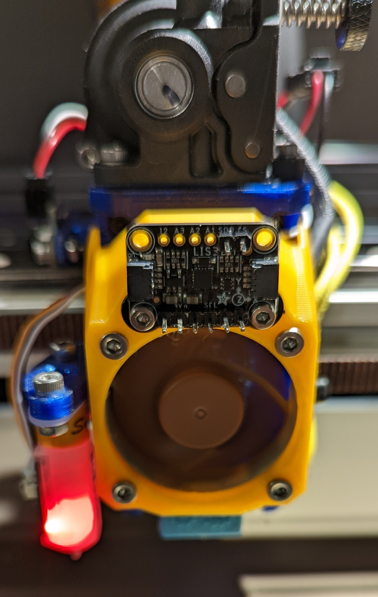

> Created by: [Kaushik Rajan](https://github.com/greatguitartist)

## Description
EVA Heatsink Fan Shroud with mounting option for the LIS3DH accelerometer – Intended for printers that use Duet/RRF motion control

## BOM
| No | Qty | Name                                           | Printable |
| -- | --- | ---------------------------------------------- | --------- |
| 1  | 1   | LIS3DH Shroud                                  | [Yes](stl/LIS3DH_Shroud.stl) |
| 2  | 2   | DIN 912 M2.5 8m                                | No        |
| 3  | 1   | LIS3DH                                         | No        |
| 4  | 2   | M2.5 Nut                                		    | No        |

## Compatible EVA version
2.0 and newer.

## Print instructions
No of perimeters: 4 
Top/Bottom Layers: 4 
Infill: 30%+
Infill Type: Cubic/Gyroid
These settings ensure a rigid structure that won’t vibrate and throw off the accelerometer readings during input shaping.

## Step Files
You can find the STEP file at [greatguitartist's LIS3DH shroud](assets/LIS3DH_Shroud.step)
