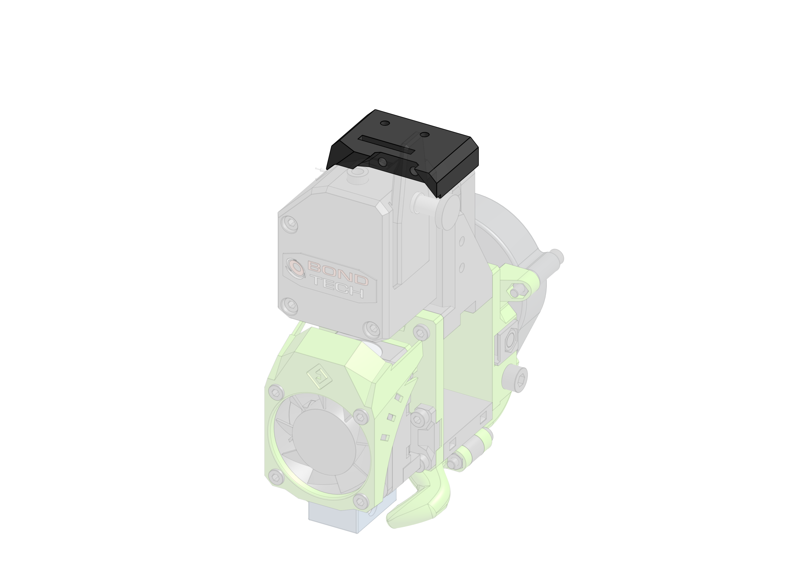

> Created by: [Tomasz Paluszkiewicz](https://github.com/tomaski)

## Description
An accelerometer mount atop the BMG stepper motor.

Design incorporates a groove under the place where header pins poke down, to ble able to lay the accelerometer flat on the mount.

## BOM
| No | Qty | Name                                           | Printable |
| -- | --- | ---------------------------------------------- | --------- |
| 1  | 1   | adxl345-bmg                                    | [Yes](stl/adxl345-bmg.stl) |
| 2  | 2   | DIN 912 M3 25 mm                               | No        |
| 3  | 1   | AXDL345                                        | No        |
| 4  | 2   | ISO 7380 M3 6 mm                               | No        |

## Compatible EVA version
2.0 and newer.

## Print instructions
Print it vertically. 2 shells, 20-30% infill and 0.2 layer height should be fine.

## Step Files
you can export step files from OnShape