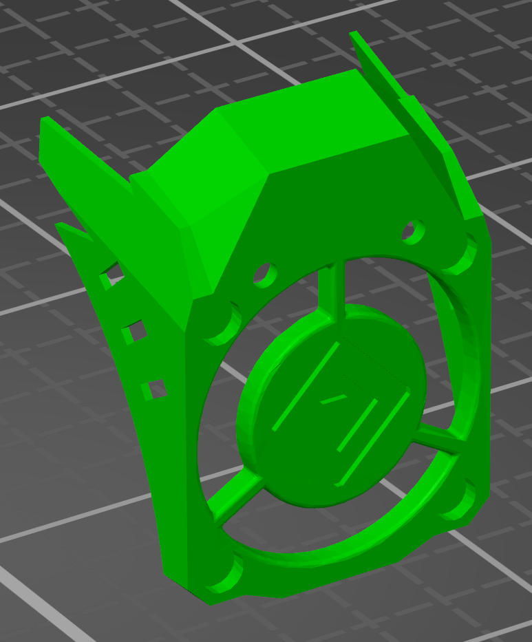

> Created by: Shufflez

## Description
Universal Accelerometer Mount for LIS3DH ([Adafruit STEMMA-formfactor](https://www.adafruit.com/product/2809) mounted at the EVA-shroud.
Mounting hole spacing is 20.32mm (0.8") as per [datasheet](https://learn.adafruit.com/adafruit-lis3dh-triple-axis-accelerometer-breakout/downloads).
The LIS3DH (and S-variant) are supported as of Duet3D's RepRapFirmware release 3.4.0b2.

This model is a quick and dirty tinkercad remix from [Oranginator's ADXL345](https://github.com/Oranginator) mount.
Hopefully I one day get around to model proper one :).

## BOM
| No | Qty | Name                                           | Printable |
| -- | --- | ---------------------------------------------- | --------- |
| 1  | 1   | LIS3DH Shroud                                  | [Yes](stl/lis3dh_shroud.stl) |
| 2  | 2   | DIN 912 M3 6mm (depending on pin protusion)    | No        |
| 3  | 1   | [LIS3DH](https://www.adafruit.com/product/2809)| No        |
| 4  | 2   | M3 Nut                                  	    | No        |
| 5  | 2   | Optional M3 nylon washer                                | No        |

## Compatible EVA version
2.0 and newer.

## Print instructions
Print it so that the EVA-logo is flat on the bed.

## Step Files
You can find the original STEP-File at [Oranginator's ADXL345 shroud mount](assets/adxl345_shroud.STEP)
