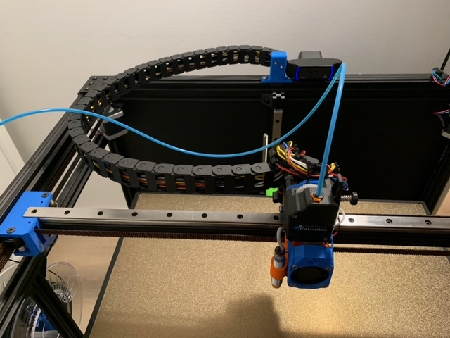

# Description

> Created by: [Mikkel Schmidt](https://github.com/miklschmidt)

A cable chain carriage mount and frame anchor for the [10x20 TANCUDER drag chain found on amazon.de](https://www.amazon.de/gp/product/B07VGC8QJR/)

The EVA carriage mount part replaces the Universal Cable Mount for the EVA Back. You will need 3x M3x10mm and 3 M3 hex nuts for attaching the mount to the EVA back.

You might need another hole pattern for your particular drag chain, if you adapt this design or create a new one, please submit it via pull request! Step files are at the bottom of this page.

# Compatible EVA version
1.1 and newer.

# BOM
| No | Qty | Name                                           | Printable |
| -- | --- | ---------------------------------------------- | --------- |
| 1  | 5   | M3 x 10mm                                      | No        |
| 1  | 2   | M3 x 25mm                                      | No        |
| 2  | 7   | M3 Hex nuts                                    | No        |
| 3  | 4   | M3 Washer                                      | No        |
| 6  | 1   | 2020 Frame Anchor                              | [Yes](../stl/tancuder_10x20_cable_chain_2020_frame_anchor.stl) |
| 6  | 1   | EVA Carriage Mount                             | [Yes](../stl/tancuder_10x20_cable_chain_eva_mount.stl) |

# Print instructions
Follow the general EVA guidelines. At least 2 perimeters and 20% infill at .2mm or .3mm layer height. Find a big flat surface to go against the build plate.

# Step Files
[2020 Frame Anchor](../assets/tancuder_10x20_cable_chain_2020_frame_anchor.step)

[EVA Carriage Mount](../assets/tancuder_10x20_cable_chain_eva_mount.step)