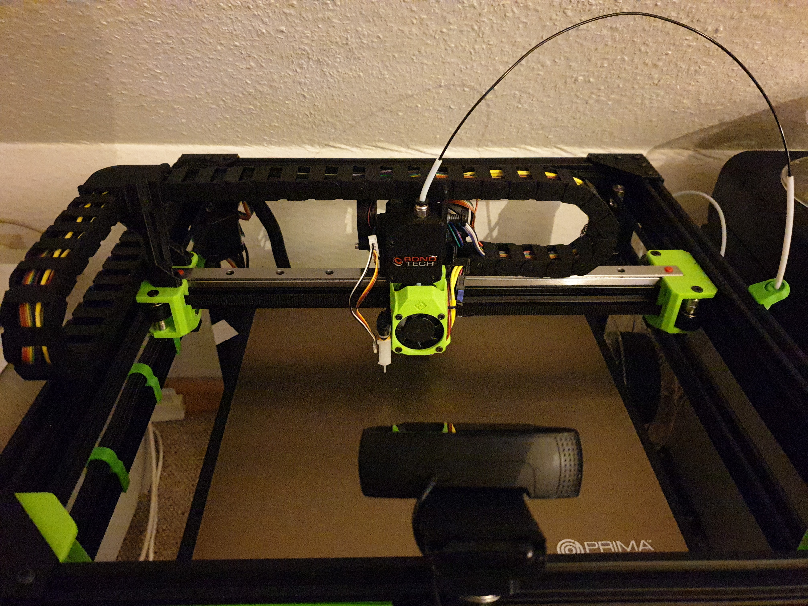

## Description

> Created by: Supersniffles (@SuperSniffles)

This Mod adds XY cable chain support to the V-Core Pro.
Use `xy_cable_chain_extruder_mount_std` for the original setup with one fan on the back, and `xy_cable_chain_extruder_mount` if you already use my 5015 dual fan mod.

## Compatible EVA version
2.0.0 --> 2.2.1

## Related EVA Parts
This mod has only been tested with a BMG setup, but should work with all top mounted extruders.

The `xy_cable_chain_back_adxl_opt` is for mounting an ADXL in place of the Universal Cable Mount.

The `xy_cable_chain_stepper_slider` is mounted to the two holes on the top of the extruder mount, and prevents the X chain from getting caught on the carriage.

The `xy_cable_chain_extruder_mount(_std)` mounts to the bottom hole in the side of the extruder mount and one hole of the MGN top.

## BOM
| No | Qty | Name                                           | Printable |
| -- | --- | ---------------------------------------------- | --------- |
| 1  | ?   | M3 screws                                      | No        |
| 2  | ?   | M3 nuts                                        | No        |
| 3  | 2   | Cable Chain                                    | [Amazon](https://www.amazon.de/gp/product/B07VGC8QJR/) |
| 4  | 1   | xy_cable_chain_back_adxl_opt                   | [Yes](stl/xy_cable_chain_back_adxl_opt.stl) |
| 5  | 1   | xy_cable_chain_extruder_mount_std              | [Yes](stl/xy_cable_chain_extruder_mount_std.stl) |
| 6  | 1   | xy_cable_chain_extruder_mount                  | [Yes](stl/xy_cable_chain_extruder_mount.stl) |
| 7  | 1   | xy_cable_chain_xy_joiner_hood                  | [Yes](stl/xy_cable_chain_xy_joiner_hood.stl) |
| 8  | 1   | xy_cable_chain_xy_joiner                       | [Yes](stl/xy_cable_chain_xy_joiner.stl) |
| 9  | 1   | xy_cable_chain_stepper_slider                  | [Yes](stl/xy_cable_chain_stepper_slider.stl) |

## Print instructions
LH = 0.2

Nozzle = 0.4

Supports needed on some parts

## Step Files
[xy_cable_chain_back_adxl_opt](assets/xy_cable_chain_back_adxl_opt.stp)

[xy_cable_chain_extruder_mount_std](assets/xy_cable_chain_extruder_mount_std.stp)

[xy_cable_chain_extruder_mount](assets/xy_cable_chain_extruder_mount.stp)

[xy_cable_chain_xy_joiner_hood](assets/xy_cable_chain_xy_joiner_hood.stp)

[xy_cable_chain_xy_joiner](assets/xy_cable_chain_xy_joiner.stp)

[xy_cable_chain_stepper_slider](assets/xy_cable_chain_stepper_slider.stp)
