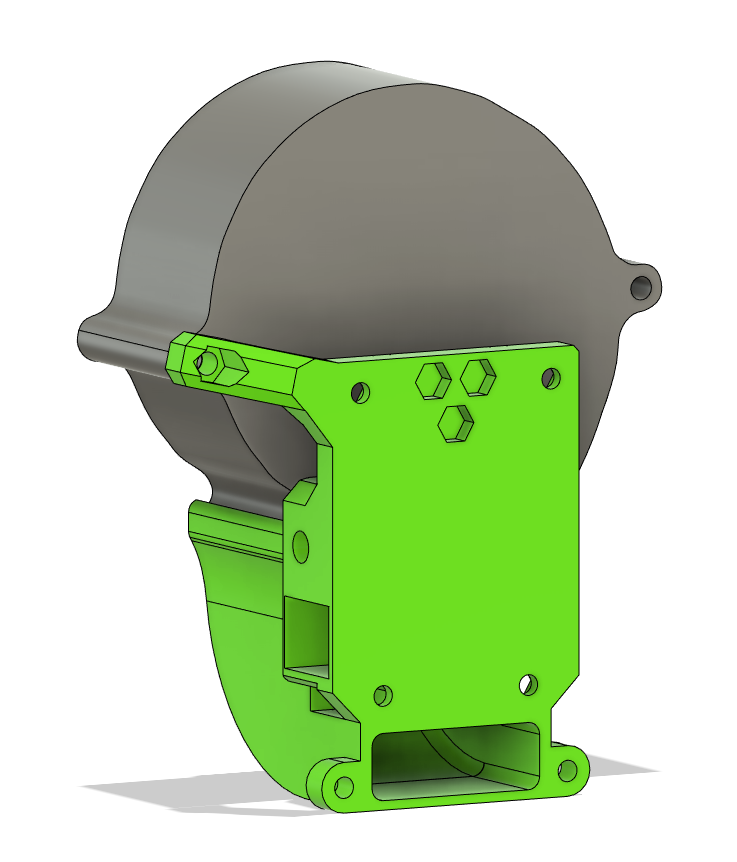
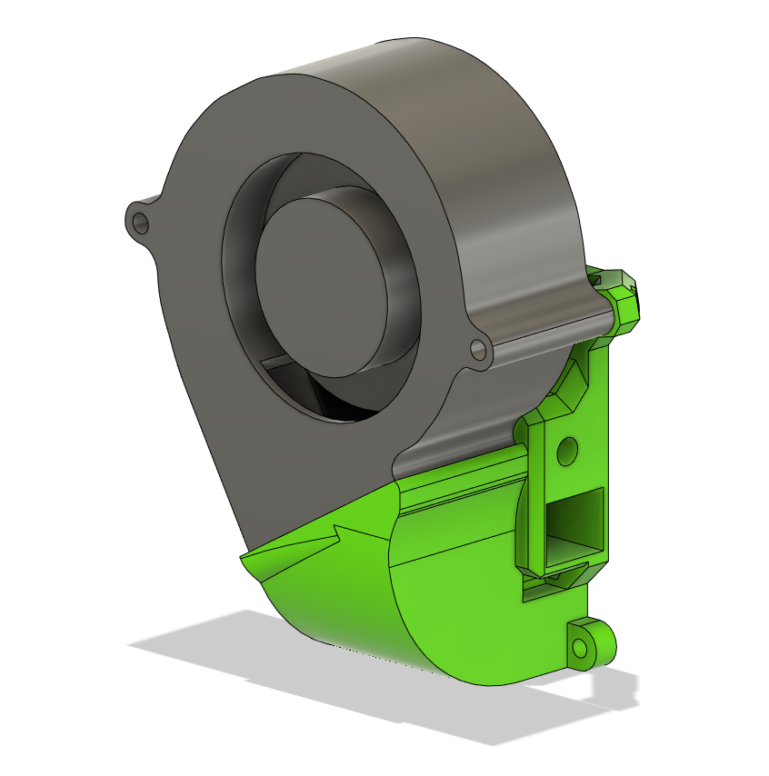

## Description

> Created by: [Mikkel Schmidt](https://github.com/miklschmidt)

This mod replaces the Core XY back with a 7530 fan mount to provide additional cooling capacity over the stock 5015. It uses a wider MGN bottom and monster duct from version 2 of [SuperSniffles' Dual 5015 Mod](dual_5015_part_fan.md).
Only supports MGN12 at this time, but is compatible with supersniffles' mgn12_wide bottom, only the split in the middle might decrease performance a tiny bit. Your mileage may vary.

Alternatively you can use the Occam's duct that i made, which also seem to perform very well, especially for low pressure fans. An extra benefit is that it's much less prone to warping at higher temperatures. In fact i've been using a PLA version without issues at 90 degrees bed temperature.

## Compatible EVA version
2.0 and newer.

## BOM
| No | Qty | Name                                           | Printable |
| -- | --- | ---------------------------------------------- | --------- |
| 1  | 1   | M3 hex nut                                     | No        |
| 1  | 1   | M3 x 35mm                                      | No        |
| 6  | 1   | 7530 EVA Back                                  | [Yes](stl/7530_fan_back_corexy.stl) |
| 6  | 1   | 7530 MGN12 Bottom Wide                         | [Yes](stl/7530_fan_mgn12_bottom_wide.stl) |
| 6  | 1   | SuperSniffles' Monster Duct v2.3               | [Yes](stl/dual_5015_monster_horns_duct_v2.3.stl) |
| 6  | 1   | Occam's Duct                                   | [Yes](stl/7530_fan_occams_duct.stl) |

## Print instructions
Follow the general EVA guidelines. At least 2 perimeters and 20% infill at .2mm or .3mm layer height. No supports needed.

## Step files
[7530 Back](assets/7530_back_corexy.step)