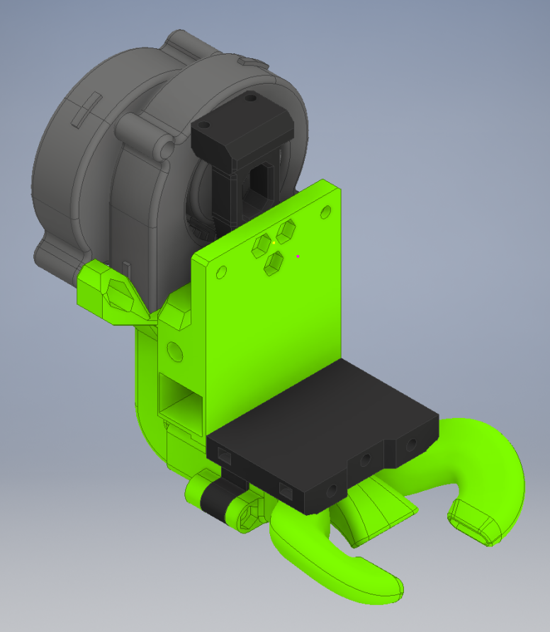
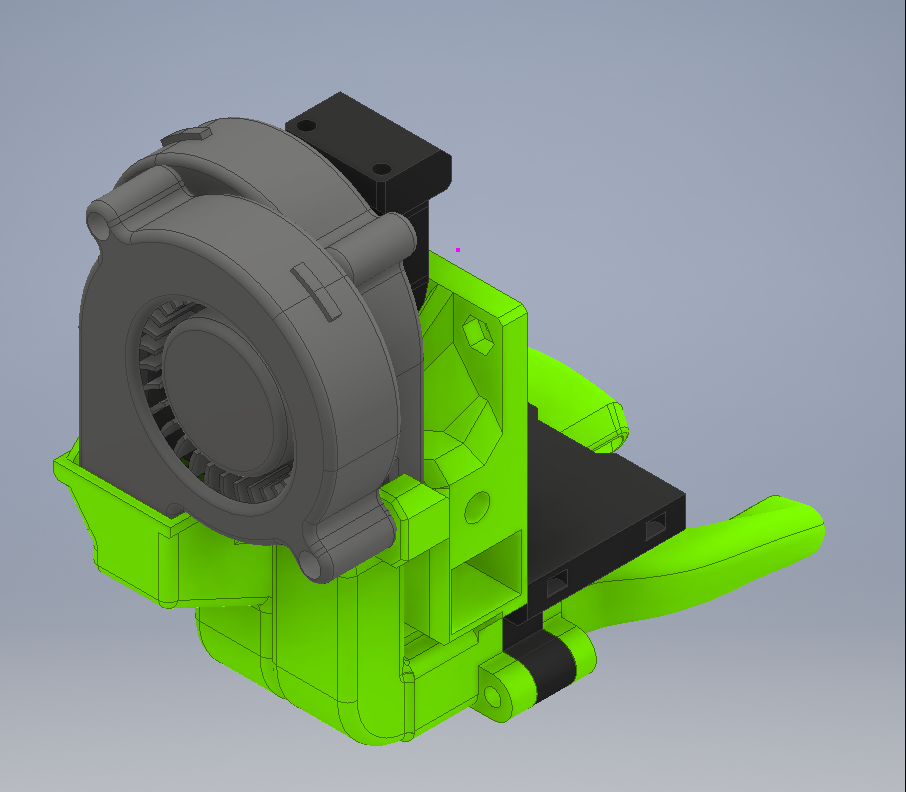
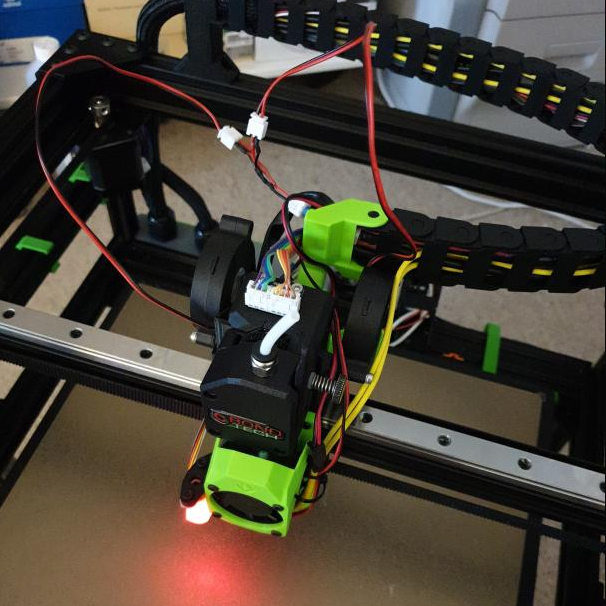

## Description

> Created by: Supersniffles (@SuperSniffles)

This Dual 5015 Part Fan mod replaces the single 5015 Part Fan located on the backplate with 2 5015 Part Fans. The mod is intended to supply a higher cooling capacity than the standard setup.

Version 2 of this mod is printable without support and doesn't require another MGN15 top. It also widens the bottom duct by 10mm and comes with a beefier horns duct to allow much more air to pass for better cooling performance. Version 2 supports both MGN15 and MGN12.

See [Dual 5015 Cable Chain](../cable_chain/dual_5015_part_fan_cable_chain.md) for cable chain support.

Note: Parts 4 and 8 are modified versions for use with brass heated inserts, modified by top_gun_de. They replace parts 3 and 7.

V2

V1

## Compatible EVA version
2.0.0 --> 2.4.1

## Related EVA Parts
This mod replaces `back_corexy` and `top_bmg_mgn15`

## V2 BOM
| No | Qty | Name                                                       | Printable |
| -- | --- | ---------------------------------------------------------- | --------- |
| 1  | 2   | 5015 Blower Fan                                            | No        |
| 2  | ?   | Various M3 screws                                          | No        |
| 3  | 1   | dual_5015_back_v2.0                                        | [Yes](stl/dual_5015_back_v2.0.stl) |
| 4  | 1   | dual_5015_back_v2.0_heat_inserts (Optional)                | [Yes](stl/dual_5015_back_v2.0_heat_inserts.stl) |
| 5  | 1   | dual_5015_bottom_mgn12_wide                                | [Yes](stl/dual_5015_bottom_mgn12_wide.stl) |
| 6  | 1   | dual_5015_bottom_mgn15_wide                                | [Yes](stl/dual_5015_bottom_mgn15_wide.stl) |
| 7  | 1   | dual_5015_monster_horns_duct_v2.3                          | [Yes](stl/dual_5015_monster_horns_duct_v2.3.stl) |
| 8  | 1   | dual_5015_monster_horns_duct_v2.3_inserts (Optional)       | [Yes](stl/dual_5015_monster_horns_duct_v2.3_heat_inserts.stl) |
| 9  | 1   | dual_5015_adxl_mount_v2.0                                  | [Yes](stl/dual_5015_adxl_mount_v2.0.stl) |

## V1 BOM
| No | Qty | Name                                           | Printable |
| -- | --- | ---------------------------------------------- | --------- |
| 1  | 2   | 5015 Blower Fan                                | No        |
| 2  | ?   | Various M3 screws                              | No        |
| 3  | 1   | dual_5015_part_fan_core_xy_back                | [Yes](stl/dual_5015_part_fan_core_xy_back.stl) |
| 4  | 1   | dual_5015_part_fan_top_bmg_mgn15               | [Yes](stl/dual_5015_part_fan_top_bmg_mgn15.stl) |
| 5  | 1   | dual_5015_part_fan_connector                   | [Yes](stl/dual_5015_part_fan_connector.stl) |

## Print instructions
LH = 0.2

Nozzle = 0.4

Supports needed for V1, no supports needed for V2

## V2 Step Files
[Dual 5015 Part Fan Core XY Back V2](assets/dual_5015_back_v2.0.stp)

[Dual 5015 Part Fan MGN12 Wide Bottom](assets/dual_5015_bottom_mgn12_wide.stp)

[Dual 5015 Part Fan MGN15 Wide Bottom](assets/dual_5015_bottom_mgn15_wide.stp)

[Dual 5015 Part Fan Monster Horns Duct](assets/dual_5015_monster_horns_duct_v2.3.stp)

[Dual 5015 Part Fan ADXL Mount](assets/dual_5015_adxl_mount_v2.0.stp)

## V1 Step Files
[Dual 5015 Part Fan Core XY Back](assets/dual_5015_part_fan_core_xy_back.stp)

[Dual 5015 Part Fan Top BMG MGN15](assets/dual_5015_part_fan_top_bmg_mgn15.stp)

[Dual 5015 Part Fan Connector](assets/dual_5015_part_fan_connector.stp)