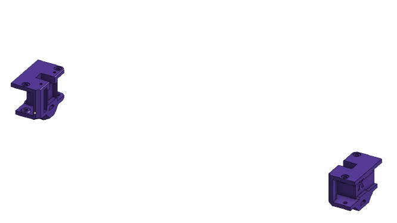
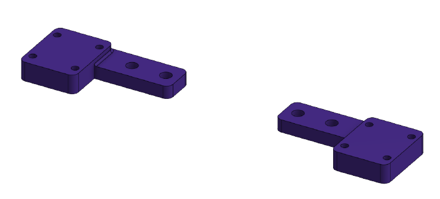

> Created by: [EOliveira](https://github.com/EduardoOliveira)

An implementation of easymod 1.2.1 using mgn12

The XY joiners are drop in replacement for the official ones.

This will allow you to use your setup with mgn12 in the X axis, mainly redugin the weight of it.

[Onshape](https://cad.onshape.com/documents/8559b0e7f5d3b30427c227c5/w/d70f098c5b327e06a1ae23f4/e/12a2436a47701eb37945bb45?configuration=List_ByYG67Ay22XcMs%3DMGN12)

If you are also using mgn12C or MGN12H on the Y axis you'll need the following adapters in place of the original aluminum plates.

You'll need longer M5 screws as this adapters are 3mm thicker than the aluminum part. I recomend printing with more tops/bottoms and higher infill to incease strength.

[Onshape](https://cad.onshape.com/documents/8559b0e7f5d3b30427c227c5/w/d70f098c5b327e06a1ae23f4/e/67166bbf807ca01f4a1ac8b3?configuration=List_V5TmcWwH5u18OA%3DDefault).

| No | Qty | Name                                           | Printable |
| -- | --- | ---------------------------------------------- | --------- |
| 1  | 1   | XY Joinner Right                               | [Yes](stl/XY_Joiner_mgn12_xy_joiner_right.stl)       |
| 2  | 1   | XY Joinner Left                                | [Yes](stl/XY_Joiner_mgn12_xy_joiner_left.stl)        |
| 3  | 1   | Joinner plateA C or H                          | [Yes (mgn12c)](stl/Joiner_Plates_mgn12C_A.stl) / [Yes (mgn12h)](stl/Joiner_Plates_mgn12H_A.stl)        |
| 4  | 1   | Joinner plateB C or H                          | [Yes (mgn12c)](stl/Joiner_Plates_mgn12C_B.stl) / [Yes (mgn12h)](stl/Joiner_Plates_mgn12H_B.stl)        |
