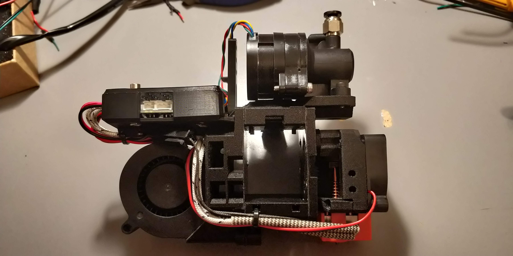

> Created by: [Maciej Raczyński](https://github.com/wichur)

Allows mounting a Duet Toolboard 1LC v1.1 to the back plate in horizontal position. Alligned to keep within side boundaries of duct horns.

## Features
 - Positioned horizontally, above print fan
 - Vertical post for cable strain relief
 - Zip tie holes (2.5mm) for cable management
 - Place to support PTFE tube that helps to guide cables

## Compatibility
 - EVA 2.2.0 
 - Duet Toolboard 1LC v1.1
 - duet3_toolboard_1lc_common_support *Should* work also for v1.0

## Related EVA Parts
 - Replaces cable fin

## Assembly
 - Attaching Driver0 and IO connectors requires to temporarily unscrew toolboard
 - Use shorter screws to attach board to support
 - Use longer screws to attach lid

| No | Qty | Name                                           | Printable |
| -- | --- | ---------------------------------------------- | --------- |
| 1  | 2   | M3 x 8 mm                                      | No        |
| 2  | 2   | M3 x 18 mm                                     | No        |
| 3  | 4   | M3 Hex nuts                                    | No        |
| 3  | 10  | >2.5mm zip ties (optional)                     | No        |
| 8  | 1   | Common Board Support                           | [Yes](stl/duet3_toolboard_1lc_common_support.stl) |
| 9  | 1   | Lid for Toolboard 1LC v 1.1(optional)          | [Yes](stl/duet3_toolboard_1lc_v11_lid.stl)       |

### How to attach incoming cables (CAN, VIN, PTFE tube, nylon sleeve)

### Sample cable management from appliances

### Print orientation

