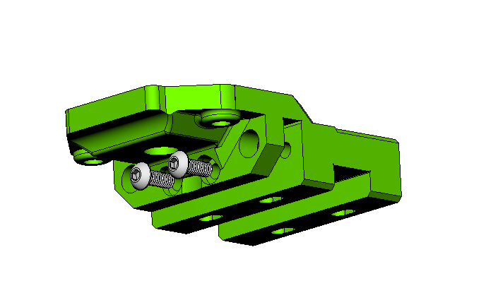
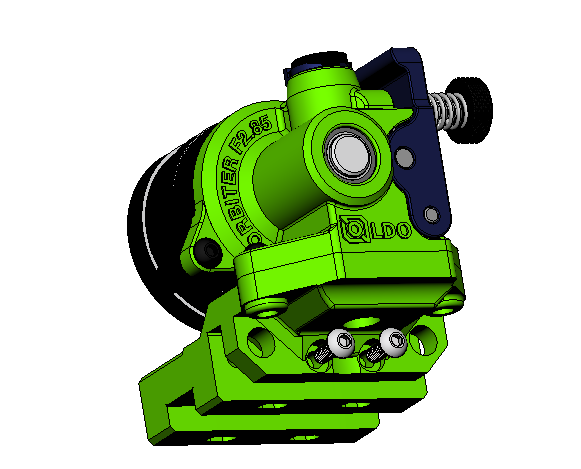
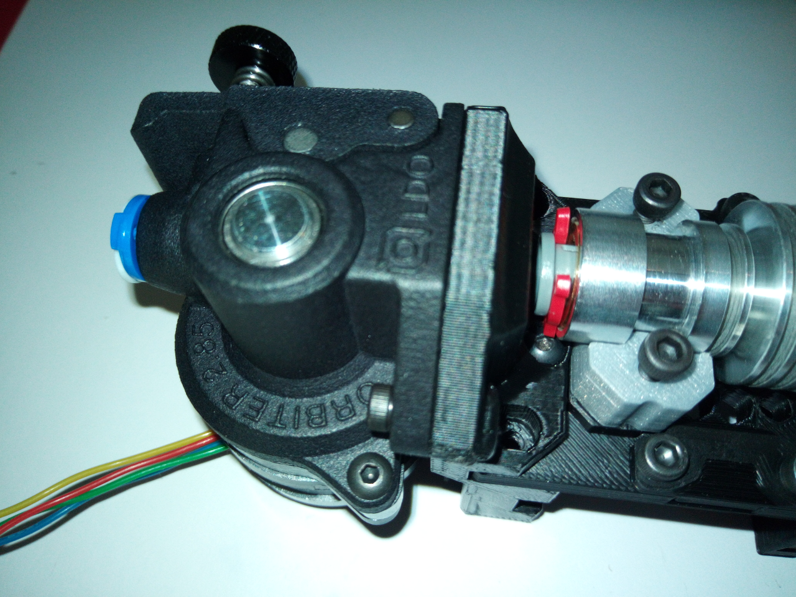

## Description

> Created by: Ruffle

This is a modified EVA 2.4 top plate for the Orbiter F2.85 and an E3D V6 2.85mm Bowden Heatsink.

It will only work with the EVA 2.4 Universal front plate, or possibly later, as the notch is a different size to earlier versions and V2.4 added the additional screws to sandwich the the Universal front plate.

You will need two M3x8 Button Head screws - normal socket head's won't fit as the top of the heatsink will hit them and two M3 heatset inserts for the Orbiter mounting screws. I used Ruthex M3x5.7 for a bit more plastic engagement.

The PTFE tube (6.35mm OD) should, in theory, be 37mm long if you can get it all the way into the E3D Heatsink. Possibly more useful is that it should protrude 9mm from the top of the mounting plate to correctly locate in the Orbiter F2.85 body.

Note:  The F2.85 Orbiter has a different footprint to the V1.5.  Dr Robert Lorincz says that the V2 Orbiter for 1.75mm filament, due Aug '21, will have the same footprint as this F2.85 version.

## Compatible EVA version
2.4

## Related EVA Parts
This mod replaces `top_orbiter_mgn12`

## BOM
| No  | Qty | Name                             | Printable                             |
| --- | --- | -------------------------------- | ------------------------------------- |
| 1   | 2   | DIN 7380 M3x8 Button Head screws | No                                    |
| 2   | 2   | Ruthex RX-M3x5.7 Heatset Inserts | No                                    |
| 3   | 1   | E3D V6 Orbiter 2.85mm Top        | [Yes](stls/E3D-V6-Orbiter-2.85mm.stl) |

## Print instructions
LH = 0.2

Nozzle = 0.4

## Step Files
[E3D V6 Orbiter 2.85mm Top](assets/E3D-V6-Orbiter-2.85mm.stp)

