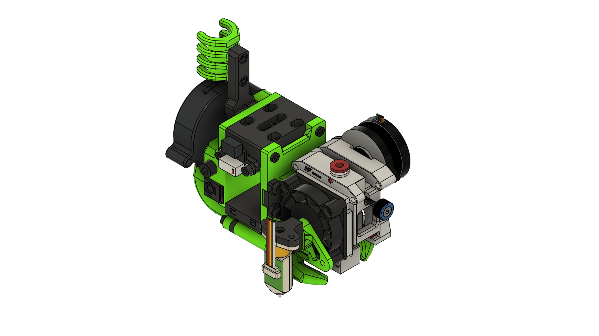
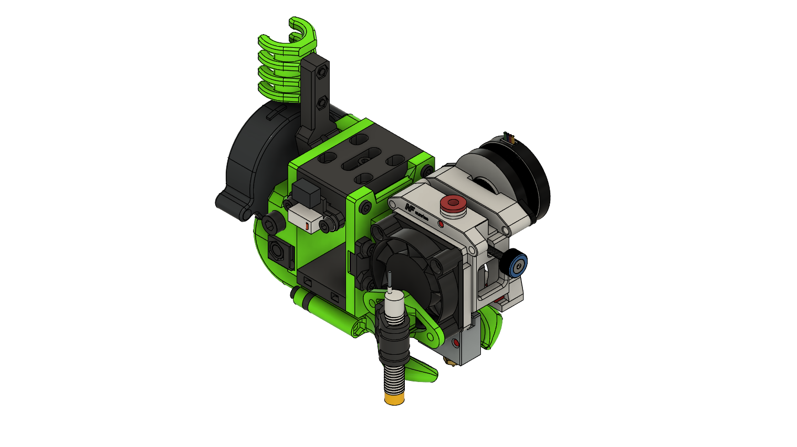

> Created by: [dmason1992](https://github.com/dmason1992)

## Description
This is a replacement front plate for mounting the Mellow Sunrise extruder/hotend combo. Note all standard ducts will need extending to reach the nozzle.

[Mellow Sunrise STEP file](stls/Assembly Mellow Sunrise.step)

[Mellow Sunrise Volcano STEP file](stls/Assembly Mellow Sunrise Volcano.step)

## Compatible EVA version
2.3.0

## Related EVA parts
Height of nozzle on both normal and volcano versions allow use of all the standard ducts. However they need extended or and extender added along with 20mm longer bolts.

## Changelog
v1.0 04/08/2021 - Initial Release

## BOM (Standard):
| No | Qty | Name                                           | Printable |
| -- | --- | ---------------------------------------------- | --------- |
| 1  | 1   | Front Plate - Mellow Sunrise.stl                         | [Yes](stls/Front Plate - Mellow Sunrise.stl) |
| 1  | 1   | Universal Probe Mount Adapter - Mellow Sunrise.stl                         | [Yes](stls/Universal Probe Mount Adapter - Mellow Sunrise.stl) |
| 1  | 1   | Standard Duct - Mellow Sunrise.stl                         | [Yes](stls/Standard Duct - Mellow Sunrise.stl) |

## BOM (Volcano):
| No | Qty | Name                                           | Printable |
| -- | --- | ---------------------------------------------- | --------- |
| 1  | 1   | Front Plate - Mellow Sunrise Volcano.stl                         | [Yes](stls/Front Plate - Mellow Sunrise Volcano.stl) |
| 1  | 1   | Universal Probe mount adapter - Mellow Sunrise Volcano.stl                         | [Yes](stls/Universal Probe mount adapter - Mellow Sunrise Volcano.stl) |
| 1  | 1   | Standard Duct - Mellow Sunrise.stl                         | [Yes](stls/Standard Duct - Mellow Sunrise.stl) |

## Additional files required

## Hardware Required 
Standard EVA

## To Do 
Physically test assembly, fit and performance. See if it performs better than the other heavier front heavy EVA's
