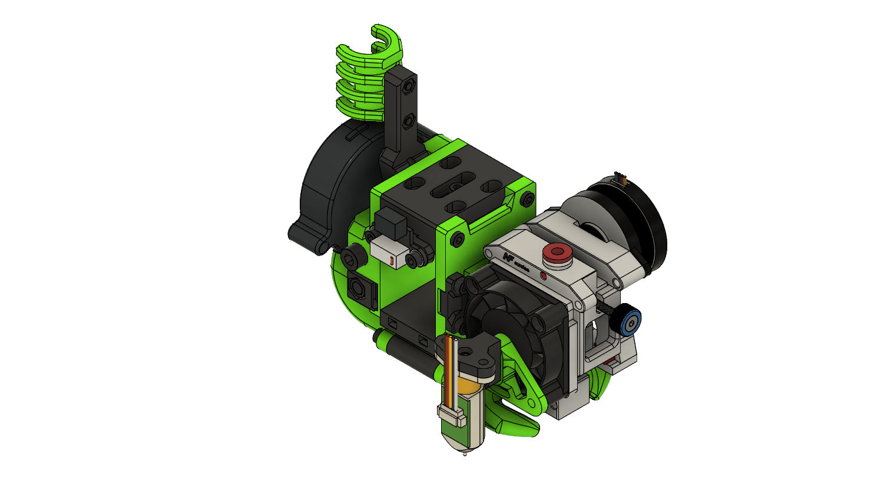

> Created by: [dmason1992](https://github.com/dmason1992)

## Description
This is a replacement front plate for mounting the Mellow Sunrise extruder/hotend combo. Note all standard ducts will need extending to reach the nozzle.

[Mellow Sunrise STEP file](stls/Mellow-Sunrise.step)

[Mellow Sunrise Volcano STEP file](stls/Mellow-Sunrise-Volcano.step)

[Mellow Sunrise Volcano with SuperSniffels dual 5015 fan mod STEP file](stls/Mellow-Sunrise-Volcano-Dual5015-Monsterduct.step)

## Compatible EVA version
2.3.0

## Related EVA parts
Height of nozzle on both normal and volcano versions allow use of all the standard ducts. However they need extended or and extender added along with 20mm longer bolts.

## Changelog
v1.0 04/08/2021 - Initial Release

V1.1 09/08/2021 - Added files for monster duct + dual5015 compatibility

v1.2 12/08/2021 - modified standard + volcano single 5015 fan versions to have the extended duct portion on the bottom part so that standard ducts can be used.

## BOM (Standard):
| No  | Qty | Name                                             | Printable                                                    |
| --- | --- | ------------------------------------------------ | ------------------------------------------------------------ |
| 1   | 1   | Mellow-Sunrise-Front-Plate.stl                   | [Yes](stls/Mellow-Sunrise-Front-Plate.stl)                   |
| 1   | 1   | Mellow-Sunrise-Universal-Probe-Mount-Adapter.stl | [Yes](stls/Mellow-Sunrise-Universal-Probe-Mount-Adapter.stl) |

## BOM (Volcano):
| No  | Qty | Name                                                     | Printable                                                            |
| --- | --- | -------------------------------------------------------- | -------------------------------------------------------------------- |
| 1   | 1   | Mellow-Sunrise-Front-Plate-Volcano.stl                   | [Yes](stls/Mellow-Sunrise-Front-Plate-Volcano.stl)                   |
| 1   | 1   | Mellow-Sunrise-Universal-Probe-Mount-Adapter-Volcano.stl | [Yes](stls/Mellow-Sunrise-Universal-Probe-Mount-Adapter-Volcano.stl) |

## BOM (Volcano - wide duct):
Take the duct + back plate from supersniffles mod folder

| No  | Qty | Name                                                     | Printable                                                            |
| --- | --- | -------------------------------------------------------- | -------------------------------------------------------------------- |
| 1   | 1   | Mellow-Sunrise-Front-Plate-Volcano.stl                   | [Yes](stls/Mellow-Sunrise-Front-Plate-Volcano.stl)                   |
| 1   | 1   | Mellow-Sunrise-Universal-Probe-Mount-Adapter-Volcano.stl | [Yes](stls/Mellow-Sunrise-Universal-Probe-Mount-Adapter-Volcano.stl) |
| 1   | 1   | Mellow-Sunrise-Bottom-Wide-Duct-Extended.stl             | [Yes](stls/Mellow-Sunrise-Bottom-Wide-Duct-Extended.stl)             |

## Hardware Required 
Standard EVA

## To Do 
Physically test assembly, fit and performance. See if it performs better than the other heavier front heavy EVA's
