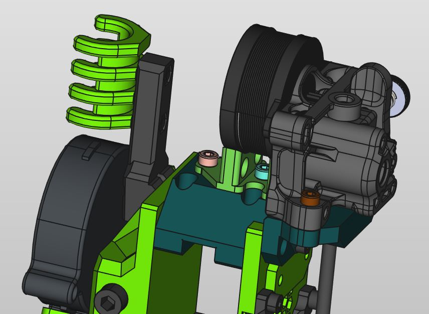
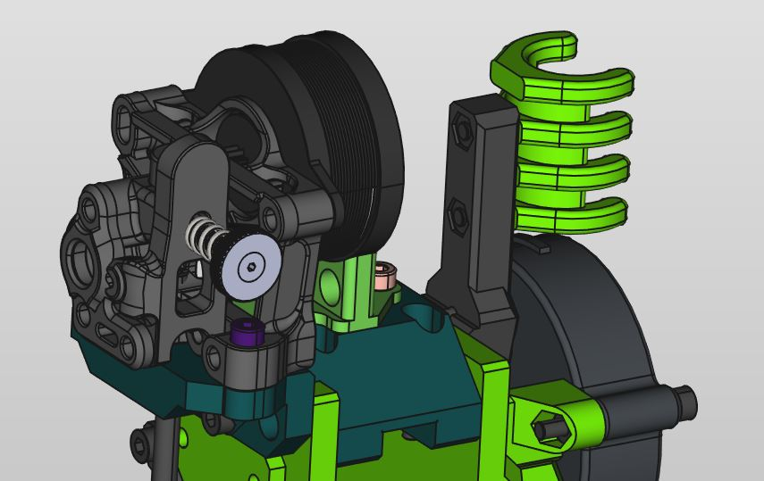
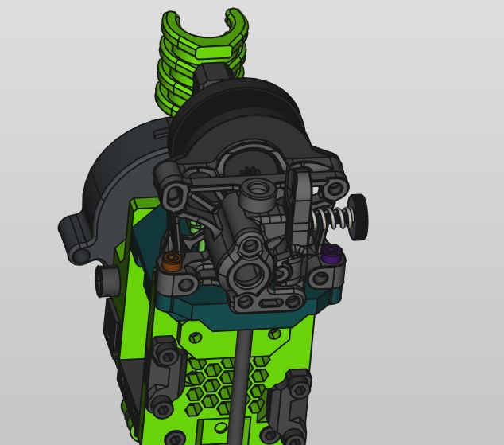

> Created by: P-C-R

## Description
This is a replacement top plate to support the Annex Engineering Sherpa Mini RC1 extruder

## Compatible EVA version
2.4.0 (unreleased, get the universal plate from the EVA Onshape document)

## Printing instructions
You have to print the main mount upside down with supports for the slot holes

## BOM
| No  | Qty | Name                         | Printable                                    |
| --- | --- | ---------------------------- | -------------------------------------------- |
| 1   | 2   | M3x12                        | No                                           |
| 2   | 2   | M3x6                         | No                                           |
| 3   | 2   | M3x5 Heated insert           | No                                           |
| 4   | 2   | M3x12                        | No                                           |
| 5   | 1   | pcr-sherpa-mini-main-mount   | [Yes](stls/pcr-sherpa-mini-main-mount.stl)   |
| 6   | 1   | pcr-sherpa-mini-motor-holder | [Yes](stls/pcr-sherpa-mini-motor-holder.stl) |

## .STEP files

[pcr-sherpa-mini-main-mount.step](assets/pcr-sherpa-mini-main-mount.step)

[pcr-sherpa-mini-motor-holder.step](assets/pcr-sherpa-mini-motor-holder.step)
