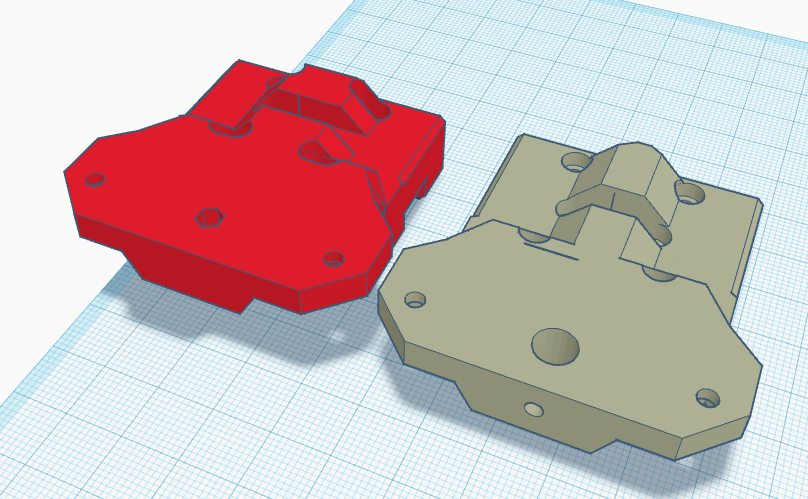

> Created by: [Boont](https://github.com/silvalis)

## Description
This is a replacement top plate to support the Annex Engineering Sherpa Mini RC1 extruder

## Compatible EVA version
2.1.0 - 2.2.1

## Related EVA parts

## Changelog
v1.0 31/03/2021 Boont Release

## BOM:
| No | Qty | Name                                           | Printable |
| -- | --- | ---------------------------------------------- | --------- |
| 1  | 1   | sherpa-mini-eva2-mgn12.stl                         | [Yes](stls/sherpa-mini-eva2-mgn12.stl) |
| 1  | 1   | sherpa-mini-eva2-mgn15c.stl                         | [Yes](stls/sherpa-mini-eva2-mgn15c.stl) |

## Additional files required

## Hardware Required 
Standard EVA

## To Do 

