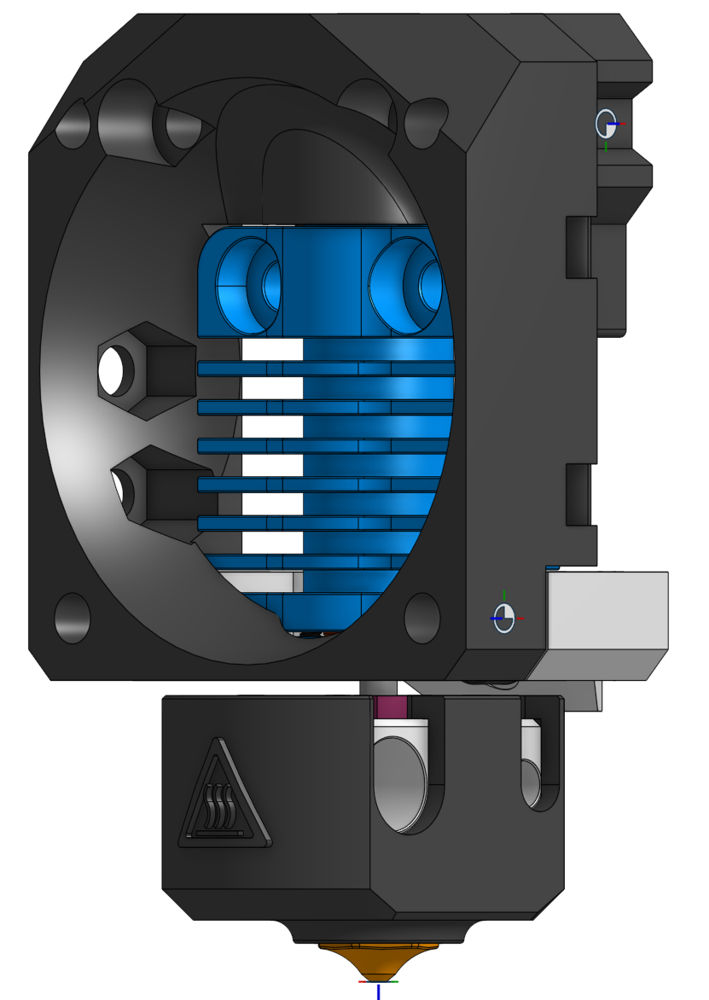
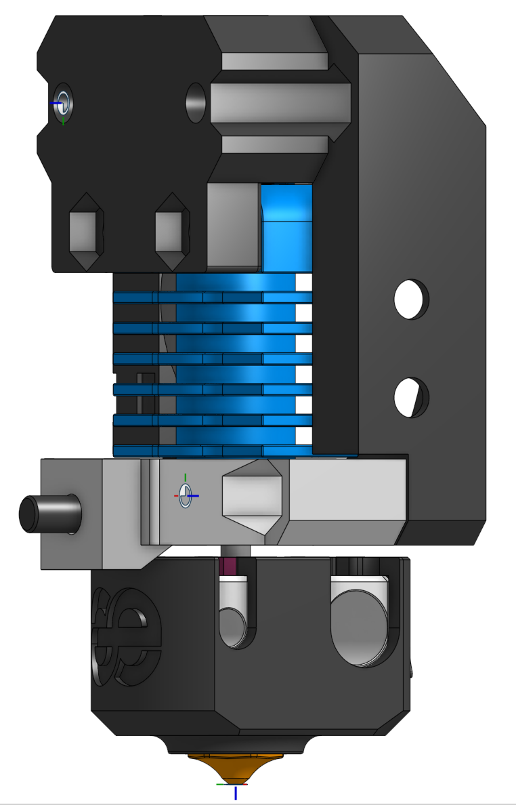
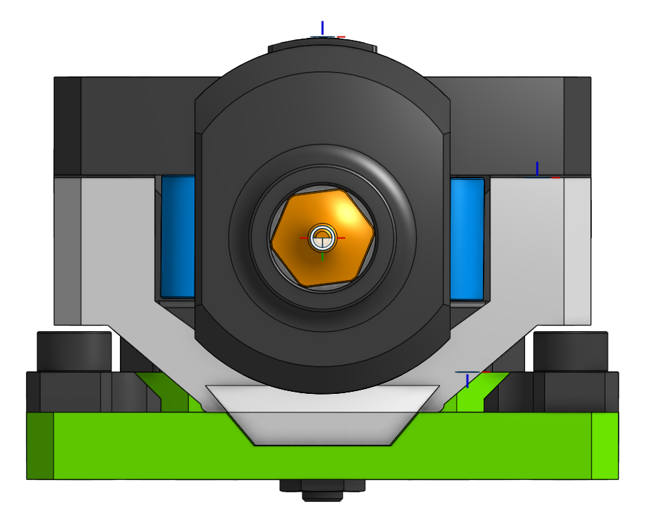

> Created by: [TheMacBoy](https://github.com/themacboy)

## Description
This is a DragonFly BMS mount for the Phaetus hotend.

## Compatible EVA version
2.2.0 - ?

## Related EVA parts
universal_face

## Source OnShape files
[DragonFly BMS](https://cad.onshape.com/documents/f5b4dc864f32153dba7690b3/w/8f750729d643301faf8fc3c8/e/c2ebd73578bb9fa59d6904bc)

## Changelog
v1.0 12/05/2021 TheMacBoy Release

## BOM:
| No | Qty | Name                                               | Printable |
| -- | --- | -------------------------------------------------- | --------- |
| 1  | 1   | [Face] eva-2.2-dragonfly-bms-face.stl    | [Yes](stl/eva-2.2-dragonfly-bms-face.stl) |
| 1  | 1   | [Face] eva-2.2-dragonfly-bms-support.stl | [Yes](stl/eva-2.2-dragonfly-bms-support.stl) |

## Hardware Required 
Standard EVA

## To Do 
