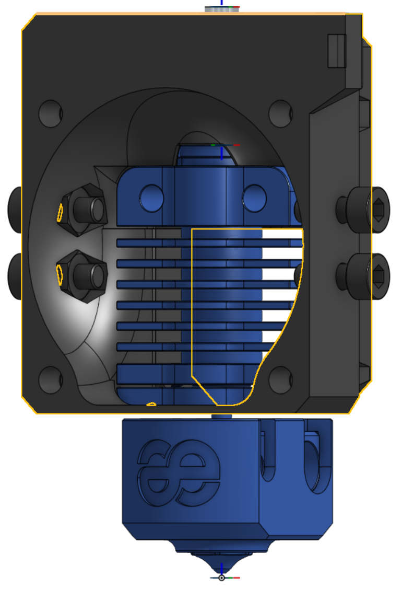
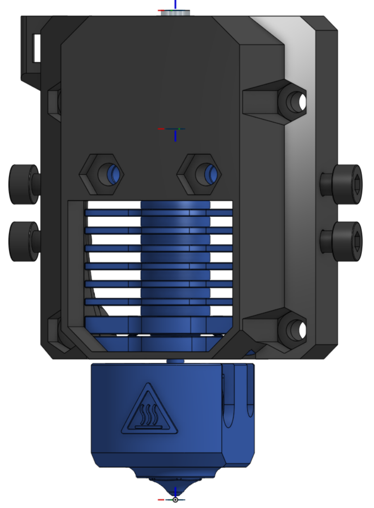
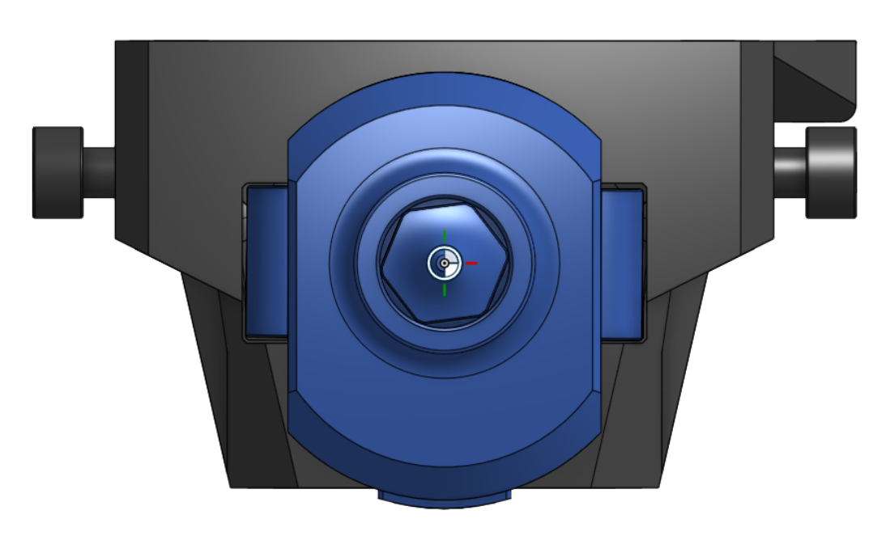

> Created by: [TheMacBoy](https://github.com/themacboy)

## Description
This is a DragonFly BMS mount (from Phaetus hotend) for EVA v.3 (with Nuts and Inserts versions)

## Compatible EVA version
3.0 - ?

## Related EVA parts
universal_face

## Source OnShape files
[Phaetus DragonFly BMS for EVA v.3](https://cad.onshape.com/documents/f2c3071c02dee08bc4257121/w/19aa83495044a1f2bdcdcab5/e/c61a755477919d1d6c7facc3)

## Changelog
v1.0 28/07/2022 TheMacBoy Release

## BOM:
| No | Qty | Name                                               | Printable |
| -- | --- | -------------------------------------------------- | --------- |
| 1  | 1   | [Nut Face] eva-3.0-dragonfly-bms-face.stl    | [Yes](stl/eva-3.0-dragonfly-bms-face.stl) |
| 1  | 1   | [Inserts Face] eva-3.0-dragonfly-bms-face-fi.stl    | [Yes](stl/eva-3.0-dragonfly-bms-face-fi.stl) |

## Hardware Required 
Standard EVA v.3

## To Do 
