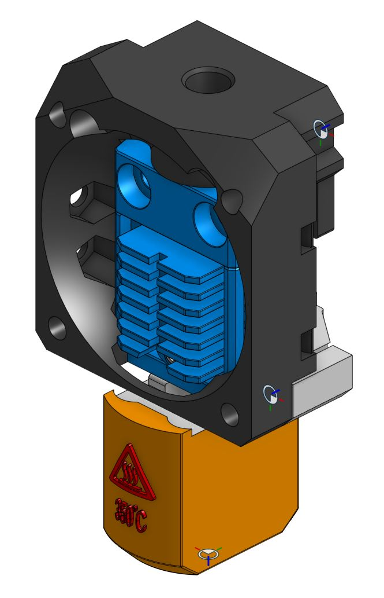
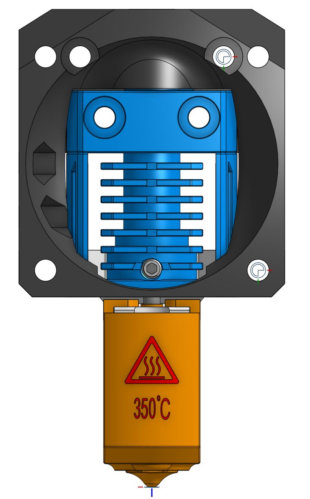
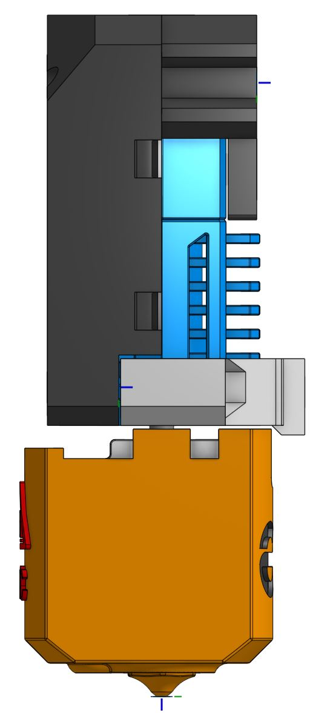
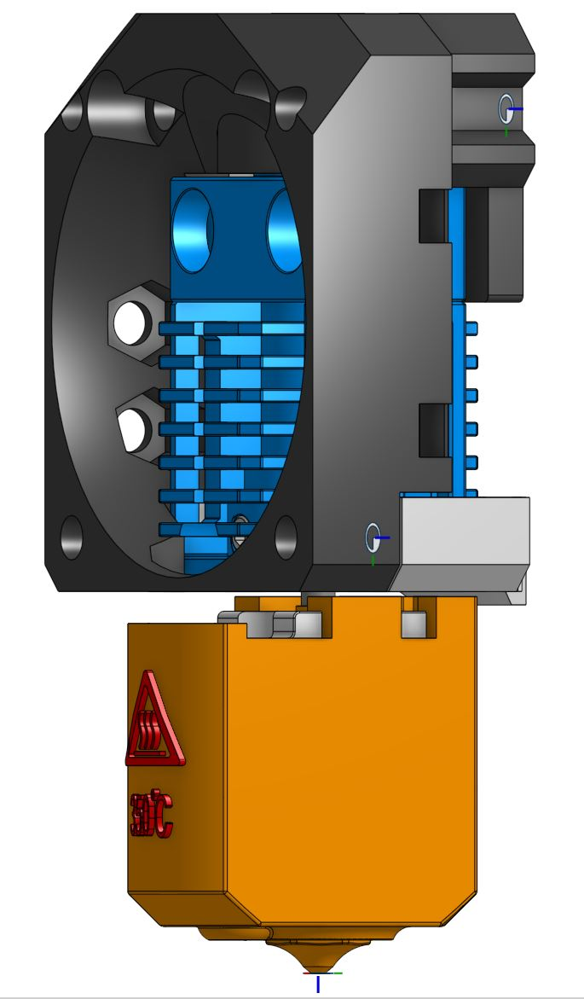
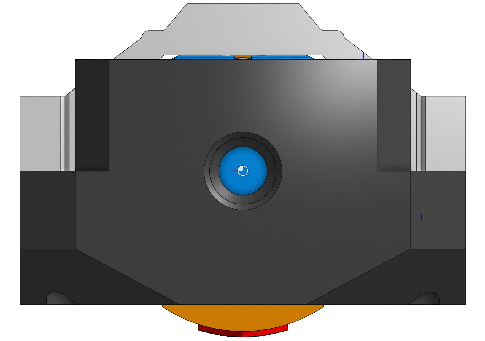
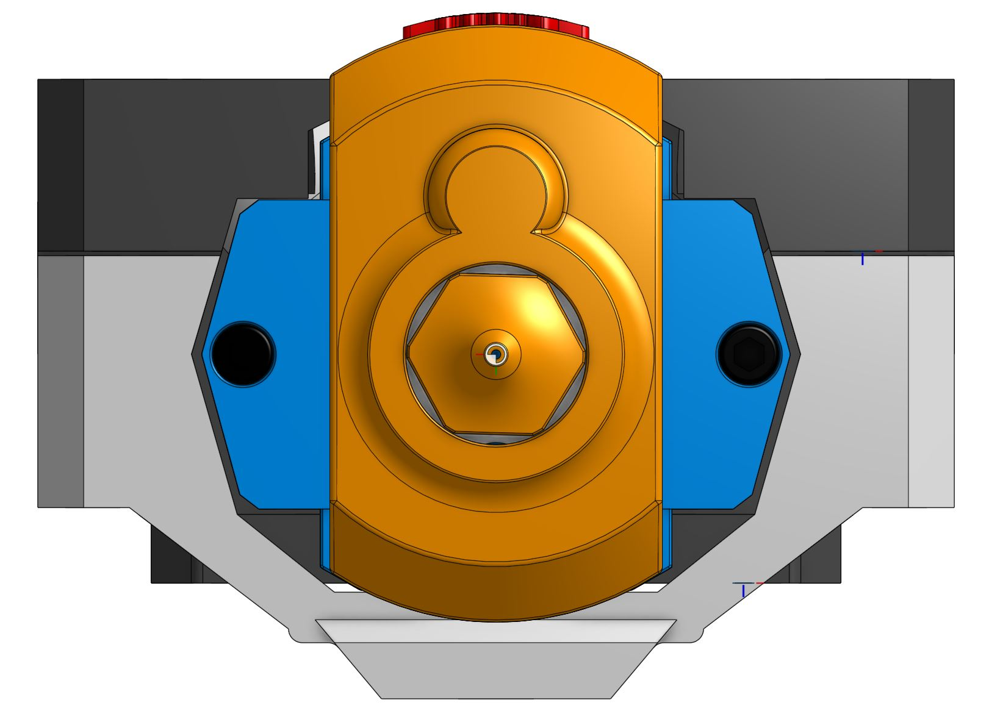

> Created by: [TheMacBoy](https://github.com/themacboy)

## Description
This is a [DragonFly HIC HF](https://www.phaetus.com/dragonfly-hf-hic) mount for the Phaetus hotend.

## Compatible EVA version
2.2.0 - ?

## Related EVA parts
universal_face

## Source OnShape files
[DragonFly HIC HF](https://cad.onshape.com/documents/37f226ec31a6892e039799c4/w/9518350d2542991b8a0226ab/e/af757332e1b18b8f33156616)

## Changelog
v1.0 12/05/2021 TheMacBoy Release

## BOM:
| No | Qty | Name                                               | Printable |
| -- | --- | -------------------------------------------------- | --------- |
| 1  | 1   | [Face] eva-2.3-dragonfly-HIC-face.stl    | [Yes](stl/eva-2.3-dragonfly-HIC-face.stl ) |
| 1  | 1   | [Support] eva-2.3-dragonfly-HIC-support.stl | [Yes](stl/eva-2.3-dragonfly-HIC-support.stl) |

## Hardware Required 
Standard EVA

## To Do 
Check if the hotend works at high speeds (+ 200 mm / s), I have currently removed some tolerances on the lower support to avoid vibrations.
