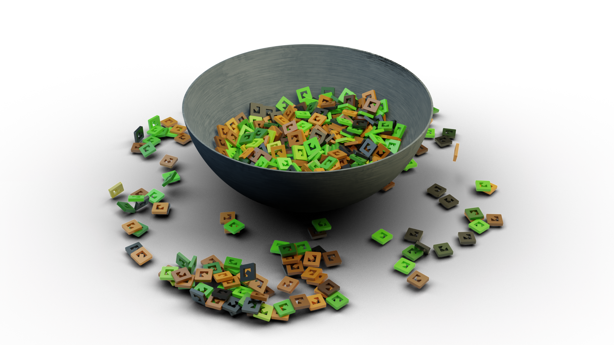

# EVA / Contrib
This is the place that houses the community contributions that do not necessarily conform 100% to the standard EVA defines, but may still be useful in specific applications. This is also a place to share other things like spool holders, test prints, etc. If you have a part or a mod you want to list here, fork the [EVA-3D/contrib-extras repository](https://github.com/EVA-3D/contrib-extras), add your files, and [submit a pull request](https://github.com/EVA-3D/contrib-extras/pulls). Anyone is welcome to contribute, in fact, the more the merrier!

# How to contribute
Fork this repository and add your stls, an image preview and a page file for presenting your part.

Part descriptions are written in markdown (.md) files.

* The main page for your part should be in `docs/[category]/[your_part_name].md` 
* Any assets linked from that page (images, etc) should be in `docs/[category]/assets`. All files should be prefixed with your part name.
* The STL(s) should be in `docs/[category]/stl`. All files should be prefixed with your part name.
* Take a look at [Pawel's Spool Holder](https://github.com/EVA-3D/contrib-extras/tree/main/docs/spool_holders) for inspiration.

If you're not familiar with Git, reach out to `@miklschmidt#2036` on discord, or get help with your submission on [the Unofficial Rat Rig Discord Server](https://discord.gg/D62e8XNeYa).

Please note that all contributes are automatically subject to the terms of the [CC BY-SA 4.0 license](https://creativecommons.org/licenses/by-sa/4.0/).

Please! Share your candy!

