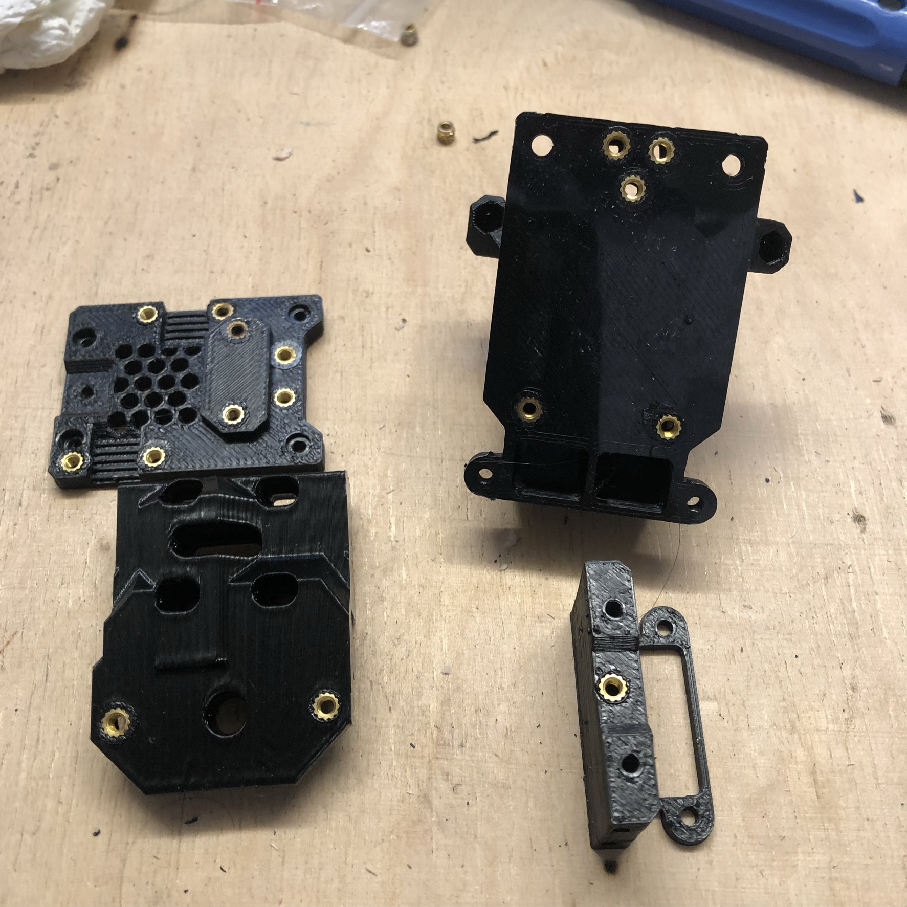

## Description:
> Created by: [Detlev Rackow](https://github.com/top-gun)

EVA is designed as a beginner-friendly carriage system, it is based on M3-screws and regular hex nuts. Brass inserts have several advantages over hex nuts: They won't fall out, and the risk of damage from too much torque is lower, especially in ABS and ASA parts. Inserting a brass inserts requires a soldering iron, and the inserts are a bit more expensive than the nuts.

EVA 2.4.1 was just released, and I modified relevant parts to accept brass inserts. The recommended sizes are M3x4.6x4 and M3x5x4. Don't use M3x5.6x4, as some holes are close to edges.

This repository contains 19 parts from EVA and two parts from the 5015 dual fan mod from Supersniffles.

I recommend to use these parts and complete your build with the parts from the regular EVA repository. The bottom part, for example, has no nut pockets so I did not modify it. The same is true for the probe mounts. You get these from the regular EVA 2.4-repository on github.

The "core" of EVA consists of:
- Universal face: Use from this contrib. Don't use the regular one, or support parts will get you into trouble.
- Top plate (holds the extruder): For Orbiter and Sherpa, use this contrib. For others use the regular parts.
- Bottom plate: Use from this contrib.
- Back plate (core-xy or cartesian): Use from this contrib.

To that, you attach a hotend face, most of these need a support part, too. Don't mix brass-fitted faces with regular support parts, they won't fit.

Fan ducts: These depend on the backplate. I clustered them into the carriage parts, together with the back plates.

Probe mounts: Use the regular ones. They have no nut pockets.

Shrouds: Use the regular parts. No nut pockets either.

## Compatible EVA versions

EVA 2.4.0 or later

## Carriage
### BOM - Carriage

| No | Qty | Name                                           | Printable | Source
| -- | --- | ---------------------------------------------- | --------- | -------
| 1  | 1   | Universal plate-brass                        | [Yes](stl/universal_face-2.4.1-inserts.stl) | [Onshape](https://cad.onshape.com/documents/74778ed34247d7556e100400/w/a58d330b6eac41d3ee1d6257/e/2d71e9f03f608830dc147b9e)
| 2  | 1   | backplate Core XY                            | [Yes](stl/back_corexy-2.4.1-inserts.stl)        |  [Onshape](https://cad.onshape.com/documents/74778ed34247d7556e100400/w/a58d330b6eac41d3ee1d6257/e/5f6109f91396259629d149cf)
| 2a | 1   | backplate Cartesian                          | [Yes](stl/back_cartesian-2.4.1-inserts.stl)        |  [Onshape](https://cad.onshape.com/documents/94ffc61ea8de2e8b4d175cb5/w/45370a8d35a588c223676b4b/e/29da292ee8a01c0ce953947a)
| 2b | 1   | backplate CoreXY-dual 5015 Supersniffles     | [Yes](stl/dual_5015_back_v3_heat_inserts.stl)        |  [Onshape](https://cad.onshape.com/documents/79d9ad219cc5cc9ce0dcf704/w/b53269836ac593db847c52c7/e/6edbe9540efb021b6a6e376c)
| 3  | 1   | Bottom plate MGN12                           | [Yes](stl/bottom_mgn12_short_duct-inserts.stl)        |  [Onshape](https://cad.onshape.com/documents/74778ed34247d7556e100400/w/a58d330b6eac41d3ee1d6257/e/884e27c8b1dbb4fb2e92761c)
| 3a | 1   | Bottom plate Dual 5015 MGN12 Supersniffles   | [Yes](stl/dual_5015_bottom_v3.stl)        |  [Onshape](https://cad.onshape.com/documents/9c252f9471d1d23ee56d6b70/w/959fe6d1b6f12c8dfe326720/e/2e778d9372bc94c95344f2a8)
| 4  | 1   | Tri-horn fan duct default                    | [Yes](stl/TriHorn-Duct-Default-2.4.2-inserts.stl)        |  [Onshape](https://cad.onshape.com/documents/0032726621935a272d71ecdd/w/8c7ff9e179be83096c43302e/e/2895bb5dddef3b905fc26f3c?configuration=List_LoFJO9VgV4Gpxp%3DDefault%3BList_ay6IJmGiZEoJuq%3DDefault&renderMode=0&uiState=61c9daeb5ae6fe74d6b1218e)
| 4a | 1   | Tri-horn fan duct default narrow             | [Yes](stl/TriHorn-Duct-Default-Narrow-2.4.2-inserts.stl)        |  [Onshape](https://cad.onshape.com/documents/0032726621935a272d71ecdd/w/8c7ff9e179be83096c43302e/e/2895bb5dddef3b905fc26f3c?configuration=List_LoFJO9VgV4Gpxp%3DDefault%3BList_ay6IJmGiZEoJuq%3DDefault&renderMode=0&uiState=61c9daeb5ae6fe74d6b1218e)
| 4b | 1   | Tri-horn fan duct high                       | [Yes](stl/TriHorn-Duct-High-2.4.2-inserts.stl)        |  [Onshape](https://cad.onshape.com/documents/0032726621935a272d71ecdd/w/8c7ff9e179be83096c43302e/e/2895bb5dddef3b905fc26f3c?configuration=List_LoFJO9VgV4Gpxp%3DDefault%3BList_ay6IJmGiZEoJuq%3DDefault&renderMode=0&uiState=61c9daeb5ae6fe74d6b1218e)
| 4c | 1   | Tri-horn fan duct high narrow                | [Yes](stl/TriHorn-Duct-High-Narrow-2.4.2-inserts.stl)        |  [Onshape](https://cad.onshape.com/documents/0032726621935a272d71ecdd/w/8c7ff9e179be83096c43302e/e/2895bb5dddef3b905fc26f3c?configuration=List_LoFJO9VgV4Gpxp%3DDefault%3BList_ay6IJmGiZEoJuq%3DDefault&renderMode=0&uiState=61c9daeb5ae6fe74d6b1218e)
| 4d | 1   | Tri-horn fan duct Volcano/Rapido UHF         | [Yes](stl/TriHorn-Volcano-Duct-UHF-2.4.2-inserts.stl)        |  [Onshape](https://cad.onshape.com/documents/0032726621935a272d71ecdd/w/8c7ff9e179be83096c43302e/e/2895bb5dddef3b905fc26f3c?configuration=List_LoFJO9VgV4Gpxp%3DDefault%3BList_ay6IJmGiZEoJuq%3DDefault&renderMode=0&uiState=61c9daeb5ae6fe74d6b1218e)
| 4e | 1   | Dual 5015 Monster horn duct Supersniffles    | [Yes](stl/dual_5015_monster_horns_duct_v2.3_heat_inserts.stl)        |  [Onshape](https://cad.onshape.com/documents/9c252f9471d1d23ee56d6b70/w/959fe6d1b6f12c8dfe326720/e/18901272a3158b3c621a46d2)
| 4f | 1   | Dual 5015 Volcano/Rapido UHF duct (Tobi)     | [Yes](stl/horn-rapido-uhf-2.4.1-inserts.stl)        |  [Onshape](https://cad.onshape.com/documents/d0c8871ffd12a03b94cb6b30/w/60becf0a1f7f2dc8485e1bea/e/336a4f443bbbc477c9fbf4a0)
| 5  | ##  | heat inserts brass M3 x D4.6 x L4              | No        | [AliExpress](https://aliexpress.com/item/4000232858343.html)

The picture are representative samples to show which holes get inserts.

## Extruders

### Orbiter 1.5, 2.0, Sherpa

[OnShape](https://cad.onshape.com/documents/081c89accea9ca68cd29ad9c/w/f873c4d34a84bfc1296409af/e/5655d7163b5af97b4bedc0b3)

| No | Qty | Name                                           | Printable | Source
| -- | --- | ---------------------------------------------- | --------- | -------
| 1a | 1   | Orbiter 1.5 top plate                          | [Yes](stl/top_orbiter_mgn12-2.4.1-inserts.stl) |
| 1b | 1   | Orbiter 2.0 top plate                          | [Yes](stl/top_orbiter_2_0_mgn12-2.4.1-inserts.stl)        |
| 1c | 1   | Sherpa top plate                               | [Yes](stl/top_sherpa_mgn12-2.4.1-inserts.stl)        |
| 2  | 2-3 | heat inserts brass M3 x D4.6 x L4                | No        | [AliExpress](https://aliexpress.com/item/4000232858343.html)_

You find the Orbiter plate above in the picture of the carriage.

## Hotends

### Mosquito

[OnShape](https://cad.onshape.com/documents/e2f2c2613337efae0a2ac6ae/w/d2d9cbef6cf272c261c0f9dd/e/01d1565488059980d5f63a9d)

| No | Qty | Name                                           | Printable | Source
| -- | --- | ---------------------------------------------- | --------- | -------
| 1  | 1   | Mosquito face                                  | [Yes](stl/mosquito_face-2.4.1-insert.stl) |
| 2  | 1   | Mosquito support                               | [Yes](stl/mosquito_support-2.4.1-r2-insert.stl)        |
| 3  | 6   | heat inserts brass M3 x D4.6 x L4                | No        | [AliExpress](https://aliexpress.com/item/4000232858343.html)_

## Dragon
### BOM - Dragon

[OnShape](https://cad.onshape.com/documents/1ac22bf6c80ea191b6a184f7/w/7e460058ed8bcbd3f81da267/e/c3f35f6b538adc71dcb7ffb1)

| No | Qty | Name                                           | Printable | Source
| -- | --- | ---------------------------------------------- | --------- | -------
| 1  | 1   | Dragon face                                  | [Yes](stl/dragon_face-2.4.1-inserts.stl) |
| 2  | 1   | Dragon support                               | [Yes](stl/v6_support-2.4.1-insert.stl)        |
| 3  | 6   | heat inserts brass M3 x D4.6 x L4              | No        | [AliExpress](https://aliexpress.com/item/4000232858343.html)_

## Dragonfly BMO
### BOM - Dragonfly BMO

[OnShape](https://cad.onshape.com/documents/4c8353d7e6e4a8f4d1b76e65/w/0a82330b0b30b282d7d53988/e/12106137cd4e147d7a075002)

| No | Qty | Name                                           | Printable | Source
| -- | --- | ---------------------------------------------- | --------- | -------
| 1  | 1   | Dragonfly BMO face                             | [Yes](stl/bmo_face-2.4.1-inserts.stl) |
| 2  | 1   | Dragonfly BMO support                          | [Yes](stl/bmo_support-2.4.1-inserts.stl)        |
| 3  | 6   | heat inserts brass M3 x D4.6 x L4                | No        | [AliExpress](https://aliexpress.com/item/4000232858343.html)_

Sorry no picture, refer to the Dragon photo

### BOM - Rapido

[OnShape](https://cad.onshape.com/documents/2140634edd2879f7c6a038d7/w/9dabf35d413e6000239b7a0d/e/b796bd6e4476ec1504d2b277)

| No | Qty | Name                                           | Printable | Source
| -- | --- | ---------------------------------------------- | --------- | -------
| 1  | 1   | Rapido face (no support required)              | [Yes](stl/face_rapido-2.4.1-inserts.stl) |
| 2  | 6   | heat inserts brass M3 x D4.6 x L4                | No        | [AliExpress](https://aliexpress.com/item/4000232858343.html)_

Note: The Rapido in HF configuration (V6 nozzles) can use all regular fan ducts, i.e. Tri-horn-duct. For the UHF-configuration, use the longer Volcano/Rapido duct from Tobi (see above)

### BOM - Nova

[OnShape](https://cad.onshape.com/documents/8bb78da485da9d371fa15665/w/dd52173389ed5d67ba8844b7/e/8d7a6916697bb187ac26cf42)

| No | Qty | Name                                           | Printable | Source
| -- | --- | ---------------------------------------------- | --------- | -------
| 1  | 1   | Nova face (no support required)                | [Yes](stl/nova_face-2.4.1-inserts.stl) |
| 2  | 2   | heat inserts brass M3 x D4.6 x L4                | No        | [AliExpress](https://aliexpress.com/item/4000232858343.html)_

