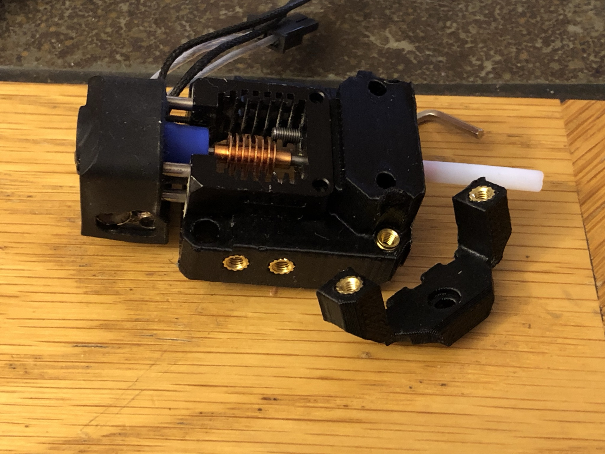
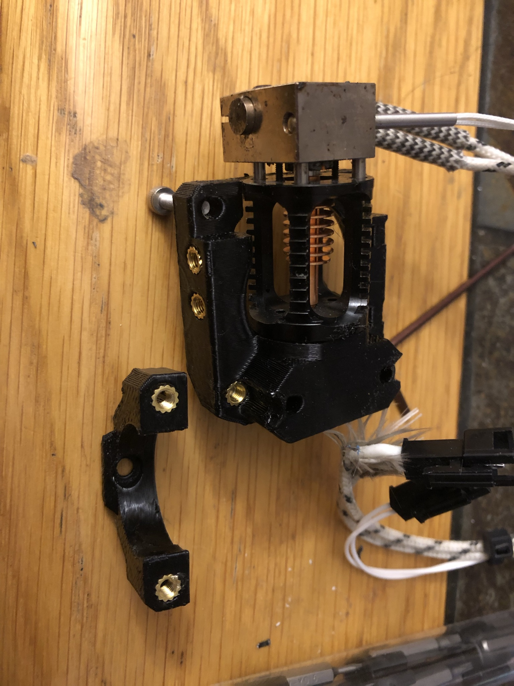

## Description:
> Created by: [Detlev Rackow](https://github.com/top-gun)

EVA is designed as a beginner-friendly carriage system, it is based on M3-screws and regular nuts. In some places, brass inserts have advantages over M3-nuts as they can't fall out during upgrades or repairs. Inserting a brass inserts requires a soldering iron, and the inserts are a bit more expensive than the nuts.

These are mounts for the popular Mosquito- and Dragon-hotends. Furthermore, I modified the Corexy-Backplate and the universal faceplate for heat inserts.

These alternative mounts for the Dragon and the Mosquito are modified to replace specific nuts with brass inserts: 
- Probe mount
- Shroud mount
- Fan duct mount

Each mount consists of the main part ("face") and a smaller bottom part ("support"). You need to reprint and exchange both parts.

The fan ducts are optional, you may continue to use your regular nut-mounted fan duct. 

[Mosquito](#mosquito)

[Dragon](#dragon)

[Carriage](#carriage)

## Compatible EVA versions

EVA 2.1 or later

## Mosquito

### BOM - Mosquito

| No | Qty | Name                                           | Printable | Source
| -- | --- | ---------------------------------------------- | --------- | -------
| 1  | 1   | Mosquito face                                  | [Yes](stl/Mosquito-face-inserts-1.2.stl) |
| 2  | 1   | Mosquito support                               | [Yes](stl/Mosquito-support-inserts-1.2.stl)        |
| 3  | 1   | Fan-duct Horn 2.1 wide/high                    | [Yes](stl/Duct-2.1-straight-wide-high-inserts.stl)       |
| 4  | 8   | heat inserts brass M3, 5mm OD, 4mm length      | No        | [vonwange](https://vonwange.com/product/100-pcs-abs-m3-inserts/) or [AliExpress](https://aliexpress.com/item/4000232858343.html)_

You may try thinner heat inserts with 4.6mm OD. Don't use the popular 5.6mm-inserts, the EVA-parts are too delicate for them.

## Dragon
### BOM - Dragon

| No | Qty | Name                                           | Printable | Source
| -- | --- | ---------------------------------------------- | --------- | -------
| 1  | 1   | Dragon face                                  | [Yes](stl/Dragon-face-insert-1.2.stl) |
| 2  | 1   | Dragon support                               | [Yes](stl/Dragon-support-insert-1.2.stl)        |
| 3  | 1   | Fan-duct Horn 2.1 straight                    | [Yes](stl/Duct-straight-insert.stl)       |
| 4  | 8   | heat inserts brass M3, 5mm OD, 4mm length      | No        | [vonwange](https://vonwange.com/product/100-pcs-abs-m3-inserts/) or [AliExpress](https://aliexpress.com/item/4000232858343.html)_

You may try thinner heat inserts with 4.6mm OD. Don't use the popular 5.6mm-inserts, the EVA-parts are too delicate for them.

## Carriage
### BOM - Carriage

| No | Qty | Name                                           | Printable | Source
| -- | --- | ---------------------------------------------- | --------- | -------
| 1  | 1   | Universal plate-brass                        | [Yes](stl/universal_face-heat-inserts.stl) | [Onshape](https://cad.onshape.com/documents/4c736c112ec9ef45421e31de/w/c02a56f6bc77ee01b6f9c24f/e/2f8dfb691df35724bb714008)
| 2  | 1   | Core XY backplate                            | [Yes](stl/back_corexy-heat-insert.stl)        |  [Onshape](https://cad.onshape.com/documents/31437c1daab8d8ec41ac3071/w/b1601359929e46e01b6f5ec3/e/7bfbcc4bf4555b088fce2dd3)
| 3  | 10 | heat inserts brass M3, 5mm OD, 4mm length      | No        | [vonwange](https://vonwange.com/product/100-pcs-abs-m3-inserts/) or [AliExpress](https://aliexpress.com/item/4000232858343.html)_

Attention: There is still one M3-nut on the Universal face where the hotend-support gets bolted on. There is not enough plastic to securely hold a brass insert.

You may try thinner heat inserts with 4.6mm OD. Don't use the popular 5.6mm-inserts, the EVA-parts are too delicate for them.

