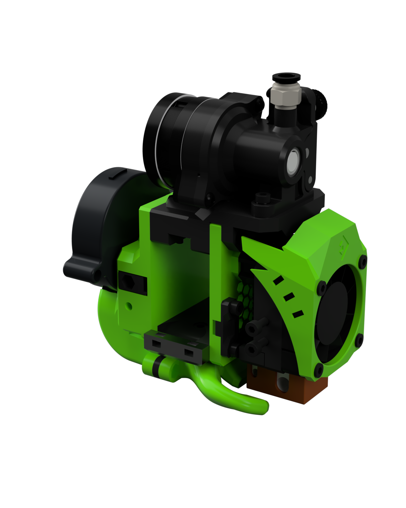
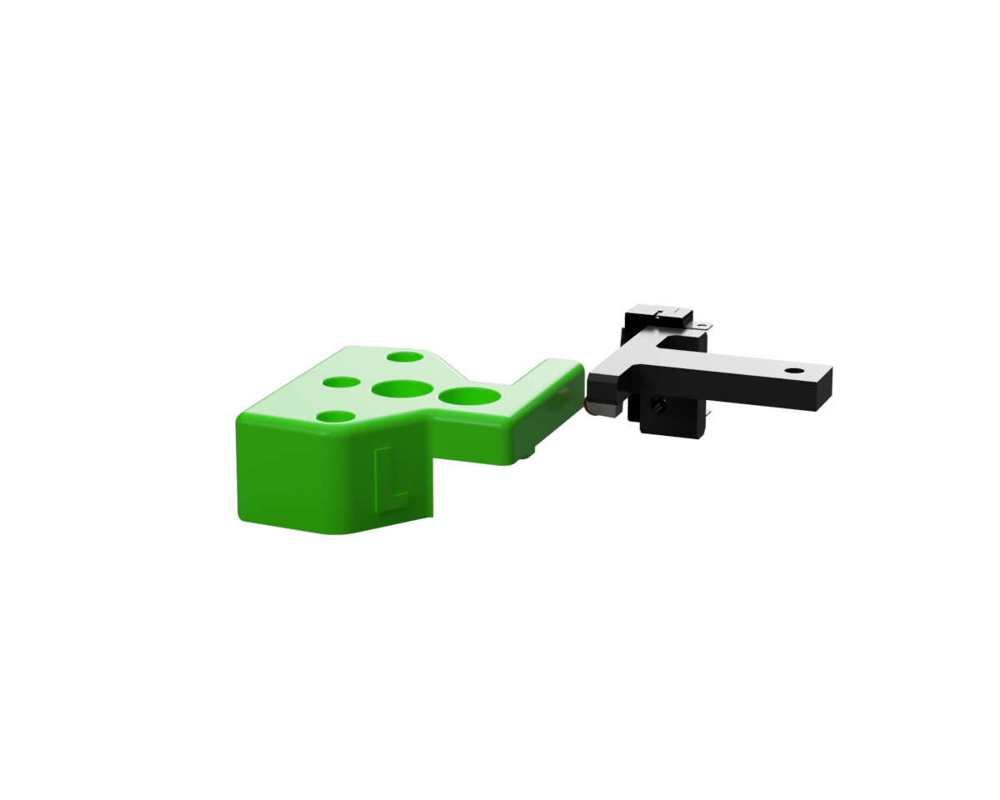
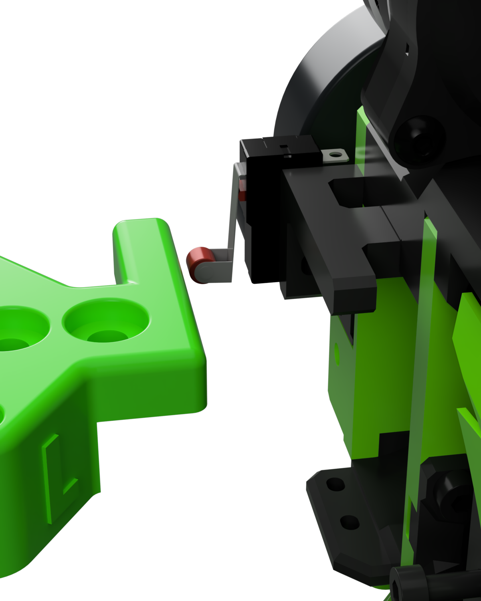
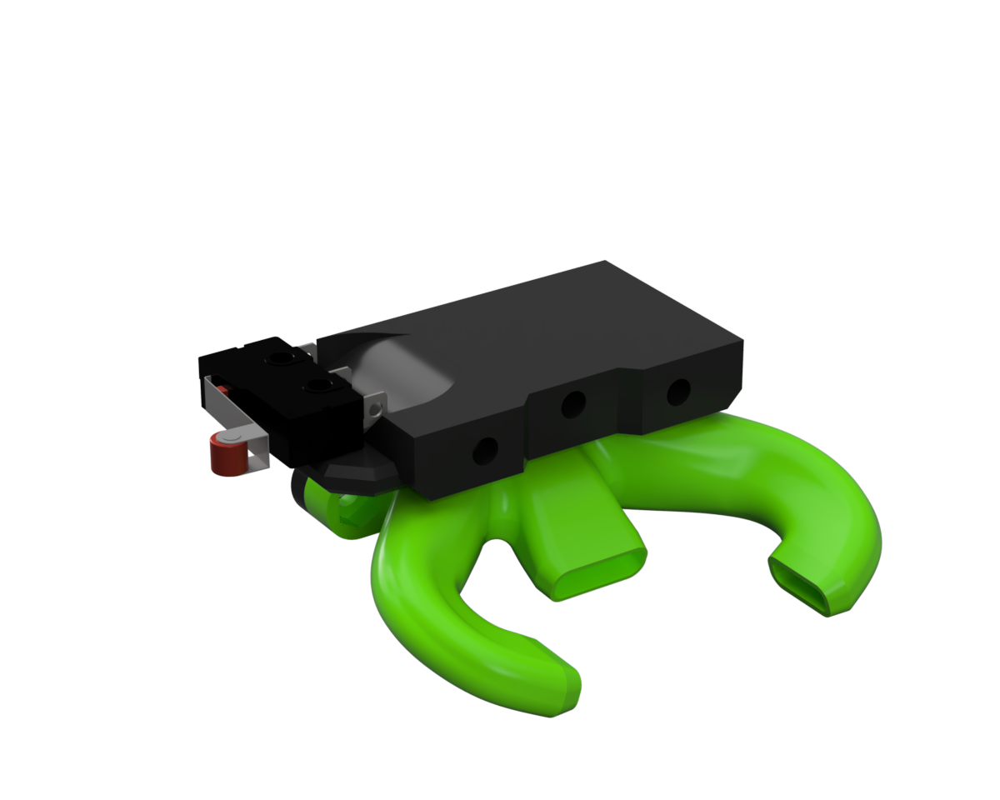

> Created by: [tetele](https://github.com/tetele)

## Description
Mounting kit for the [EVA v2.4](https://eva-3d.github.io/eva-main/) on the [BLV MGN Cube printer](https://www.blvprojects.com/blv-mgn-cube-3d-printer).

For older releases, [check out this page](https://github.com/tetele/contrib-extras/releases).

The standard EVA hotend carriage was designed for printers using 9mm belts with a different orientation than the BLV MGN Cube. This kit provides all the parts needed to use the EVA on the BLV MGN Cube.

The kit only supports hotends and extruders that are compatible with the original universal face (e.g. not the Titan Aero, which has a dedicated face). It also only supports 6mm timing belts.

[Thingiverse link](https://www.thingiverse.com/thing:4718073)

If you want to remix things, the [STEP files are here](assets/blv-mgn-cube.step).

## BOM

| No | Qty | Name                                           | Printable |
| -- | --- | ---------------------------------------------- | --------- |
| 1  | 1   | Modified universal face                        | [Yes](stl/blv-mgn-cube-universal_face.stl) |
| 2  | 2   | 6mm belt grabbers                              | [Yes](stl/blv-mgn-cube-face_belt_grabber.stl) |
| 3  | 1   | Modified CoreXY back                           | [Yes](stl/blv-mgn-cube-back_corexy.stl) |
| 4  | 1   | 6mm belt tensioner (left)                      | [Yes](stl/blv-mgn-cube-tension_slider_6mm_left.stl) |
| 5  | 1   | 6mm belt tensioner (right)                     | [Yes](stl/blv-mgn-cube-tension_slider_6mm_right.stl) |

## X endstop

There are several options to choose from depending on your printer configuration, ability to tweak your firmware and your willingness to replace standard parts.

### Metal kit mount + custom top-left gantry mount

- [X] Compatible with metal kit
- [X] Compatible with printed parts version (:warning: needs extra piece)

This approach uses the default hit zone on the top-left gantry mount included in the metal kit. If you use the printed parts version, you will also need to print a top-left gantry mount that emulates the hit zone of the metal kit version.

The mount is compatible with endstop switches with M2.5 holes and hole spacing between 8-9.5mm.

Thanks to Jose Elias for all the help with this approach!

| No | Qty | Name                                           | Printable |
| -- | --- | ---------------------------------------------- | --------- |
| 1  | 1   | Endstop switch mounting bracket                | [Yes](stl/blv-mgn-cube-end_stop_mount.stl) |
| 2  | 1   | DIN 912 M3x8mm socket head screw               | No |
| 3  | 1   | M3 Hex nut                                     | No |
| 4  | 2   | M2.5x12mm screw                                | No |
| 5  | 1   | Modified top-left gantry mount (not required for metal kit) | [Yes](stl/blv-mgn-cube-top-left_mount.stl) |

### Custom bottom part

- [ ] NOT compatible with metal kit
- [X] Compatible with printed parts version

This approach replaces the standard EVA bottom part (that connects the back to the front side of EVA) with a custom one that allows the attachment of and endstop holder with ducts for the wiring. The metal kit does not have a hit zone below the gantry, so this is not compatible with the metal kit.

The mount is compatible with endstop switches with M2.5 holes and hole spacing between 8-9.5mm.

| No | Qty | Name                                           | Printable |
| -- | --- | ---------------------------------------------- | --------- |
| 1  | 1   | Bottom part with endstop mount                 | [Yes](stl/blv-mgn-cube-bottom_with_endstop.stl) |
| 2  | 2   | M2.5x12mm screw                                | No |
