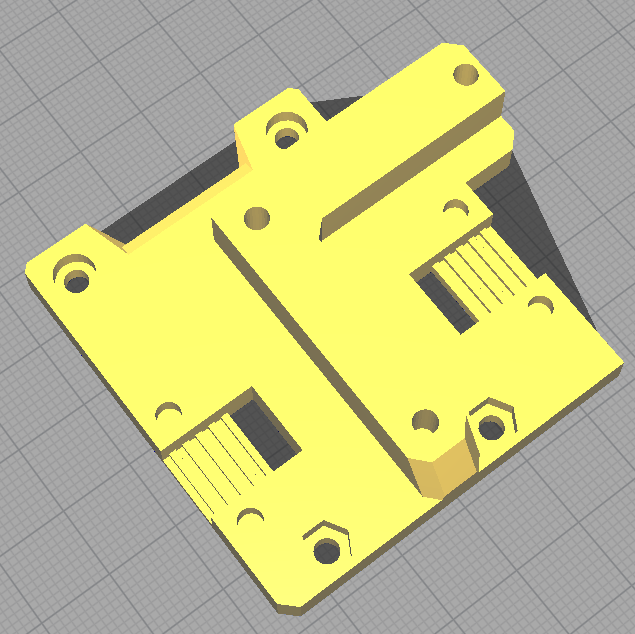

> Created by: [Poko](https://github.com/lorentzkim)

## Description
This is a modification of Hemera faceplate v2.3 for Ender 5+.

It shifts the beltgrabber slots central to the 2020 extrusion on a Ender 5+ 
printer modified with MGN12H linear rail mounted on top.

It's essentially a mix between Hemera faceplate and Boont's Ender 5/5+ mod.

## Compatible EVA version
2.3+?

## Changelog
v1.0 26/06/2021 Initial release

## Related EVA parts
This replaces `hemera_face.stl`.

Please see [Boont's](https://contrib.eva-3d.page/printer-compatibility/ender-5/)
mod for the Ender 5 flat back. Like his, this change should be compatible with
standard CoreXY backplate.

## BOM
| No  | Qty | Name                 | Printable                           |
| --- | --- | -------------------- | ----------------------------------- |
| 1   | 1   | ender-5+-hemera-face | [Yes](stl/ender-5+-hemera-face.stl) |

## Additional files required
Get the belt grabbers from the original [EVA stls](https://main.eva-3d.page).
