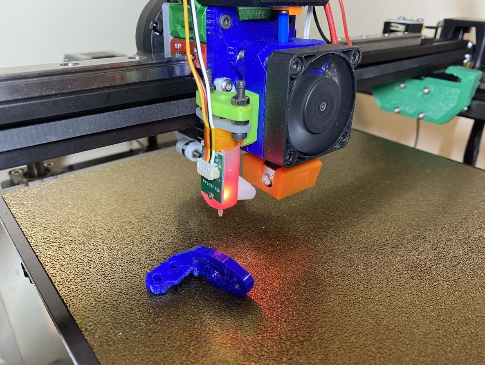

> Created by: [Boont](https://github.com/silvalis)

## Description
This is a modification of the universal faceplace v2.2 for Ender5 family printers. 
It shifts the beltgrabber slots central to the 2020 extrusion on a Ender 5 
printer modified with MGN12H linear rail mounted on top.

## Compatible EVA version
2.1.0 -> 2.2.X

## Changelog:
v1.0 03/03/2021 Boont Release
v1.1 19/04/2021 FlatESIAN back plate added

## Related EVA parts
This replaces the universal_face

This works in conjunction with a flattened backplate to preserve rear space on an 
Ender 5, however blocks the use of the vertical cable guide. The Ender 5 Plus may
use the standard corexy backplate if you wish to use the cable guide.

## BOM
| No | Qty | Name                                           | Printable |
| -- | --- | ---------------------------------------------- | --------- |
| 1  | 1   | eva-2.2-ender-5-universal-face                 | [Yes](stl/eva-2.2-ender-5-universal-face.stl) |
| 1  | 1   | eva-2.2-ender-5-flat-back               		| [Yes](stl/eva-2.2-ender-5-flat-back.stl) |

## Additional files required
Get the belt grabbers from the original [EVA 2.2 stls](https://main.eva-3d.page).

## To Do
Modify the vertical cable guide stalk to clear the flatESIAN back