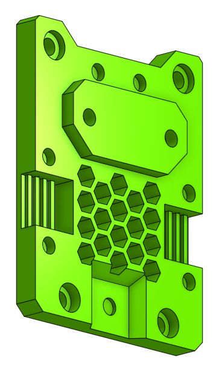
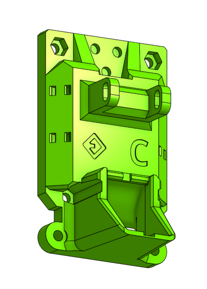
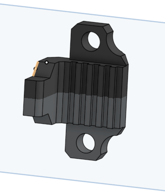
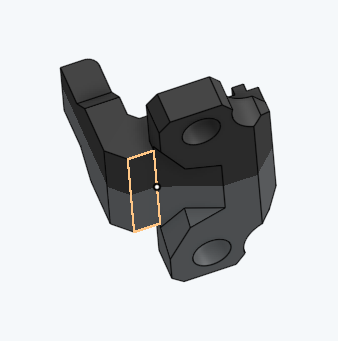

> Created by: [TheMacBoy](https://github.com/themacboy)

## Description
This is a modification of the EVA v2.4 to use in a Ender-5 Plus printer, with linear rails.

## Compatible EVA version
2.4.0 - ?

## Related EVA parts
universal_face
face_belt_grabber
back_cartesian

## Source OnShape files
[Ender-5 plus face](https://cad.onshape.com/documents/d03d2100ee259a83c906ec87/w/a98d0af5986a6f3ff43f566b/e/df764c52dda6894a5f2c4f06)
[Ender-5 plus back](https://cad.onshape.com/documents/da1ceea65b28d3d5c9468620/w/7c12dc9b0459f4481dd8fc2f/e/56bf3dc506fdcd1fd680d0a6)
[Ender-5 plus belt grabber](https://cad.onshape.com/documents/d03d2100ee259a83c906ec87/w/a98d0af5986a6f3ff43f566b/e/da71fc648af4aa7fd8af9ea2)

## Changelog
v1.0 14/02/2022 TheMacBoy Release

## BOM:
| No | Qty | Name                                               | Printable |
| -- | --- | -------------------------------------------------- | --------- |
| 1  | 1   | [Ender-5 Plus Face] ender-5_plus_face.stl    | [Yes](stl/ender-5_plus_face.stl) |
| 1  | 1   | [Ender-5 Plus Back] ender-5_plus_carthesian_back.stl    | [Yes](stl/ender-5_plus_carthesian_back.stl) |
| 1  | 1   | [Ender-5 Plus Belt grabber] ender-5_plus_belt_grabber.stl | [Yes](stl/ender-5_plus_belt_grabber.stl) |

## Hardware Required 
Standard EVA

## To Do 
