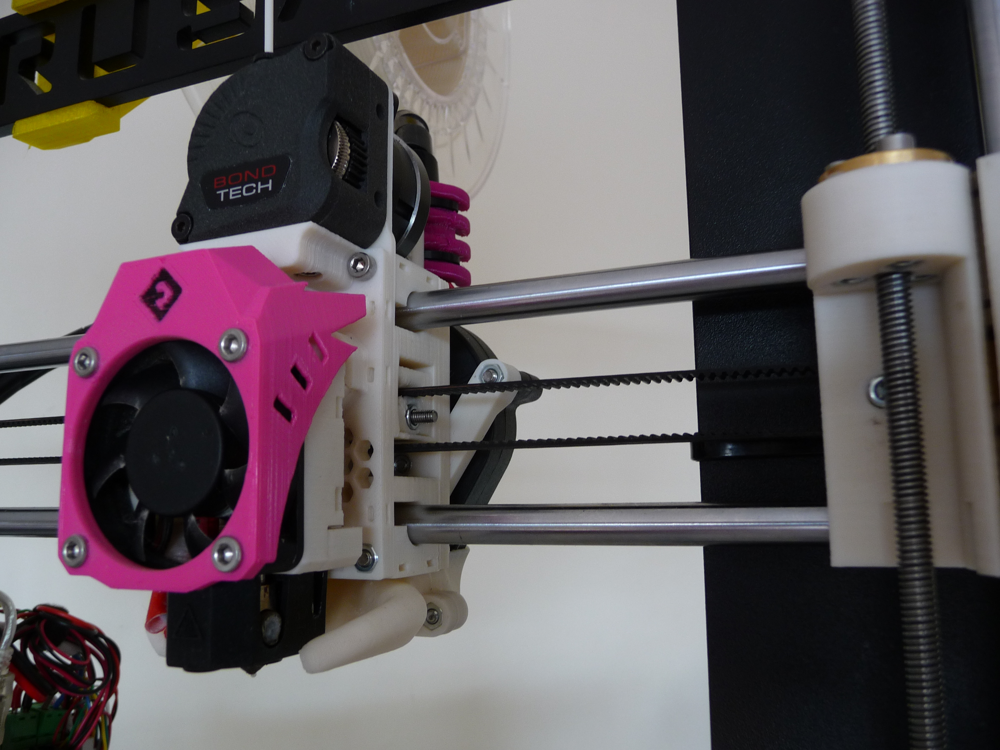
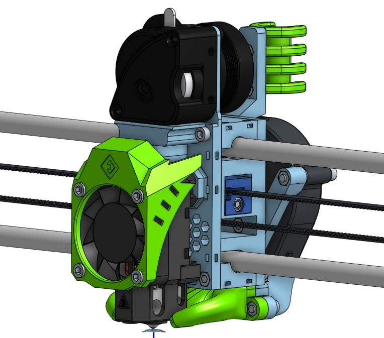
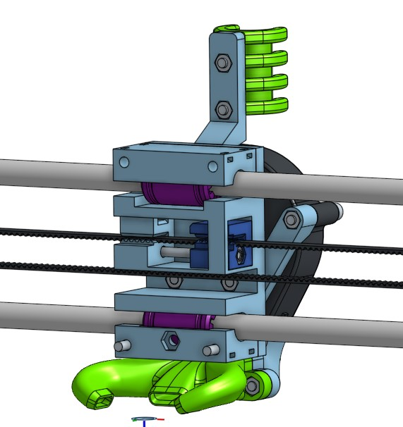
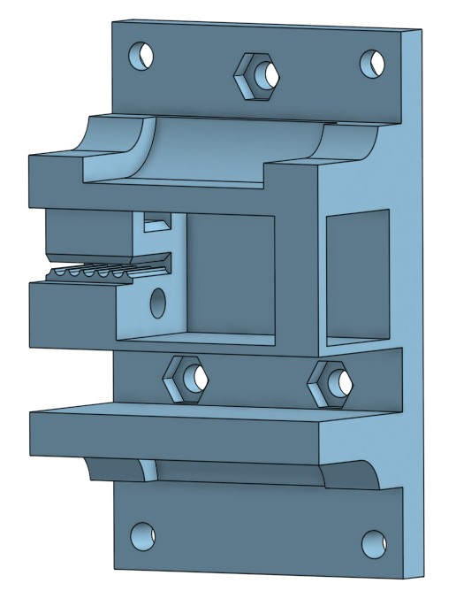

> Created by: [Petros Matsakos](https://github.com/mach0gr)

## Description

This was an attempt to revive my old Prusa i3 clone. 
Taking inspiration from the [EVA project](https://main.eva-3d.page/) ,trying to use as much from EVA ecosystem and trying to fit it within the confined boundaries of i3 I came up with this conversion.

Unfortunatley I only managed to utilize and keep compatibility with limited parts from the EVA ecosystem, particularly hotends, air horn and cable holder. Rest of the parts are more of a conversion kit for the i3 keeping however the EVA spirit.
Regarding extruders, there currently two mount plates available to fit the conversion kit, for LGX lite and for Titan.

A few photos below ilustrute the X carriage conversion on an i3.

In the pictures below from OnShape, the green and black parts are from the EVA ecosystem while the ones in blue are the ones required for i3 modification.
## i3 X carriage with LGXlite 

## i3 X carriage with Titan subassy

## i3 X carriage Back plate subassembly

## i3 X carriage front plate subassembly

## Compatibility with EVA hotends/horns

2.3.0

## BOM (excluding hotend and mounting accessories)

| No | Qty | Name                                         	| Printable 									| Part Image |
| -- | --- | -------------------------------------------- 	| --------------------------------------------- | ---------- |
| 1  | 2   | bearing rider                                	| Yes  [mach0i3_bearing_rider.stl](stl/mach0i3_bearing_rider.stl)       |  |
| 2  | 1   | back plate 									| Yes  [mach0i3_back_plate.stl](stl/mach0i3_back_plate.stl)				| 	 |
| 3  | 1   | front plate   LGXlite / Titan				| Yes  [mach0i3_front_plate_lgxlite.stl](stl/mach0i3_front_plate_lgxlite.stl) /   [mach0i3_front_plate_titan.stl](stl/mach0i3_front_plate_titan.stl) |  / |
| 4  | 1   | fan plate /   fan plate w/optional support	| Yes  [mach0i3_fan_plate.stl](stl/mach0i3_fan_plate.stl) /   [mach0i3_fan_plate_support.stl](stl/mach0i3_fan_plate_support.stl) |  /  |
| 5  | 1   | belt tensioner 								| Yes  [mach0i3_belt_tensioner.stl](stl/mach0i3_belt_tensioner.stl)      |  |
| 6  | 2   | Linear Bearing LM8UU							| No											|	|
| 7  | 1   | 5015 Fan/Blower								| No											|	|
| 8  | 12  | M3 Nut											| No											|	|
| 9  | 1   | M3 Locking Nut									| No											|	|
| 10 | 2   | M3 Din912 screw 8mm							| No											|	|
| 11 | 7   | M3 Din912 screw 10mm							| No											|	|
| 12 | 1   | M3 Din912 screw 25mm							| No											|	|
| 13 | 5   | M3 Din912 screw 30mm							| No											|	|
| 14 | 1   | PTFE tube 40mm									| No											|   |

Note that the bolts self-tap into adaptor parts.

[Onshape i3 x carriage for EVA hotend support project](https://cad.onshape.com/documents/99f26b9849712d97c941bb22/w/c940867efa0c652e4f993383/e/f244a8d39850146da104757e?renderMode=0&uiState=61efddbb5e284d03d962fee6) link (may contain not stable updates)