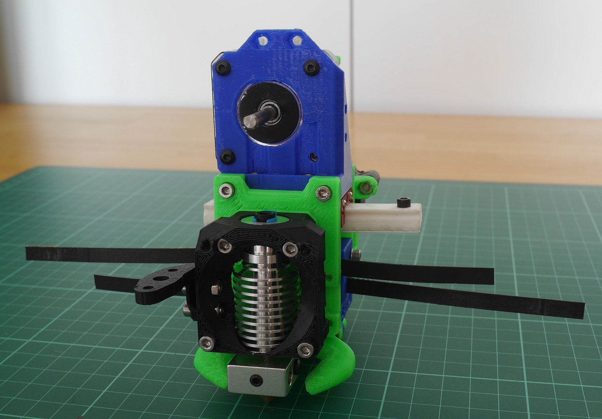

> Created by: [Martin Budden](https://github.com/martinbudden)

## Description

Adaptors to allow the  [EVA printheads](https://main.eva-3d.page/) to be used on the [MaybeCube 3D printer](https://github.com/martinbudden/MaybeCube).

Since the belt spacing used by the EVA system is different to that used by the MaybeCube, adaptors are required: an adaptor for the EVA top part and an adaptor for the EVA bottom part.

The bottom adaptor is **EVA\_MC\_bottom\_mgn12\_short\_duct.stl**.

The top adaptor varies according to the extruder used - the part name is the same as the EVA part, but prefixed by **EVA\_MC\_**. So for example if you wanted to used the Bondtech BMG extruder then you should use part **EVA\_MC\_bmg\_mgn12.stl** (rather than part **bmg\_mgn12.stl** that you would ordinarily use).

Once you have installed the top and bottom adaptors, you can use all other EVA parts in the normal way.

The photos show an EVA printhead with adaptors for the Bondtech BMG extruder.

In the pictures the adaptors are shown in blue, standard  EVA parts are shown in green and black, and MaybeCube parts are shown in red or orange.

Assembly instructions are on [github](https://github.com/martinbudden/MaybeCube/tree/main/EVA).

[Thingiverse link](https://www.thingiverse.com/thing:4912099)

## Compatible EVA version

2.3.0

## BOM

| No | Qty | Name                                           | Printable |
| -- | --- | ---------------------------------------------- | --------- |
| 1  | 1   | MC bottom adaptor                              | [Yes](stl/EVA_MC_bottom_mgn12_short_duct.stl) |
| 2  | .   | MC top Bondtech BMG adaptor                    | [Yes](stl/EVA_MC_top_bmg_mgn12.stl) |
| 3  | .   | MC top Bondtech LGX adaptor                    | [Yes](stl/EVA_MC_top_lgx_mgn12_a.stl) |
| 4  | .   | MC top Bowden adaptor                          | [Yes](stl/EVA_MC_top_mgn12.stl) |
| 5  | .   | MC top Orbiter adaptor                         | [Yes](stl/EVA_MC_top_orbiter_mgn12.stl) |
| 6  | .   | MC top E3D Titan adaptor                       | [Yes](stl/EVA_MC_top_titan_mgn12.stl) |
| 7  | 8   | M3 caphead bolt x 10mm                         | No        |

Note that the bolts self-tap into adaptor parts.
Standard EVA parts and MaybeCube parts are not shown in the BOM.

The E3D Hemera and E3D Aero extruders are not currently supported.
