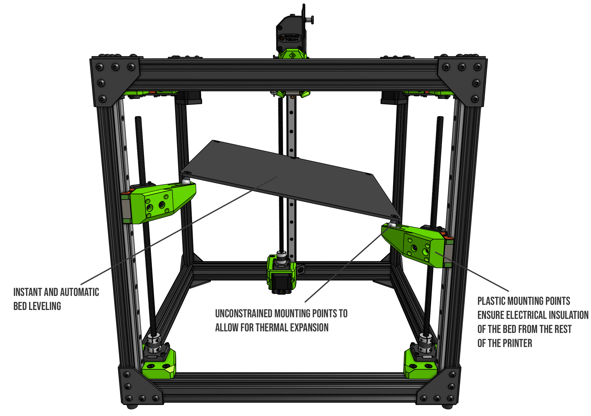

> Created by: [EOliveira](https://github.com/EduardoOliveira)

## Description
An implementation of the V-Core Pro 1.3 kinematic design using MGN12C or MGN12H

## Compatible EVA version
Any

## BOM
| No | Qty | Name                                           | Printable |
| -- | --- | ---------------------------------------------- | --------- |
| 1  | 1   | Back Arm C or H                                | [Yes (mgn12c)](stl/Bed-Arms-back-MGN12C.stl) / [Yes (mgn12h)](stl/Bed-Arms-back-MGN12H.stl)        |
| 2  | 1   | Left Arm C or H                                | [Yes (mgn12c)](stl/Bed-Arms-front-left_arm-MGN12C.stl) / [Yes (mgn12h)](stl/Bed-Arms-front-left_arm-MGN12H.stl)        |
| 3  | 1   | Right Arm C or H                               | [Yes (mgn12c)](stl/Bed-Arms-front-right_arm-MGN12C.stl) / [Yes (mgn12h)](stl/Bed-Arms-front-right_arm-MGN12H.stl)        |

## Additional files required
Get the Z motor mounts and cable strain relief from [V-Core-Pro-1.3 github](https://github.com/Rat-Rig/V-Core-Pro-1.3/tree/main/cad/01_essentials/Zaxis/STL).
