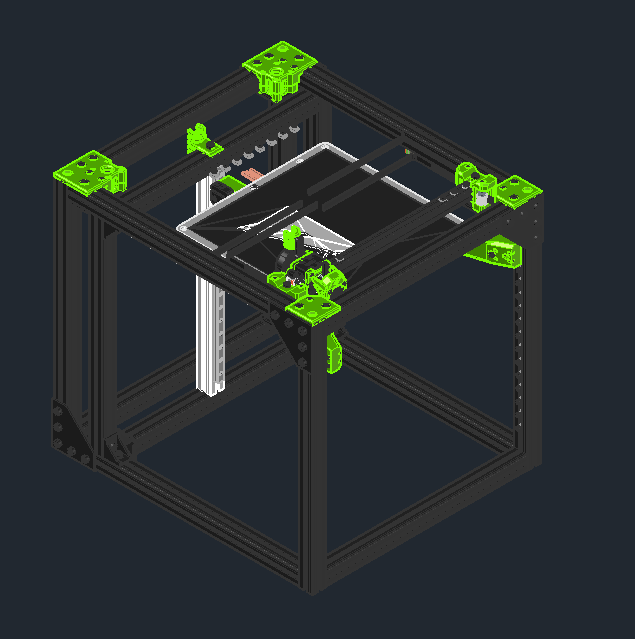
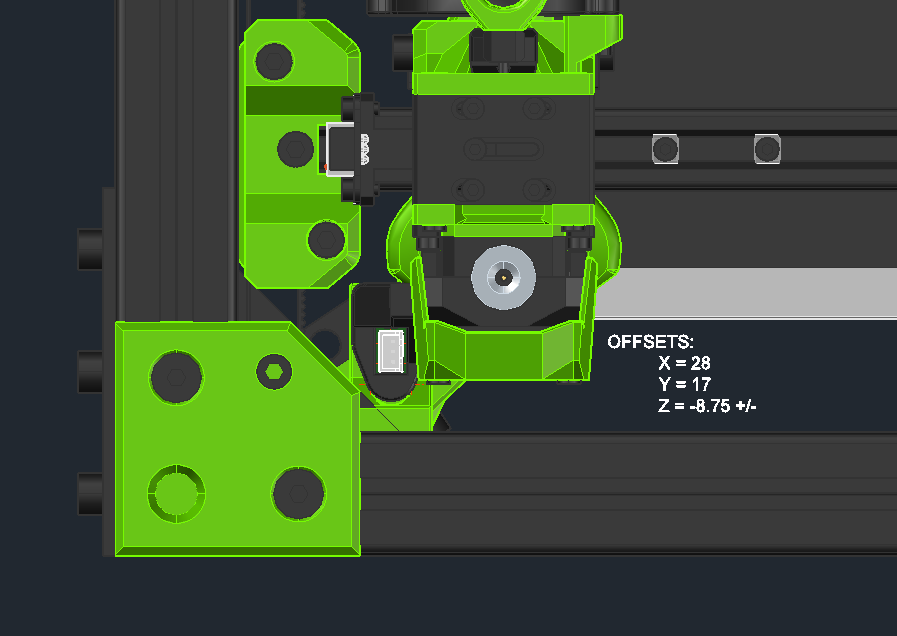
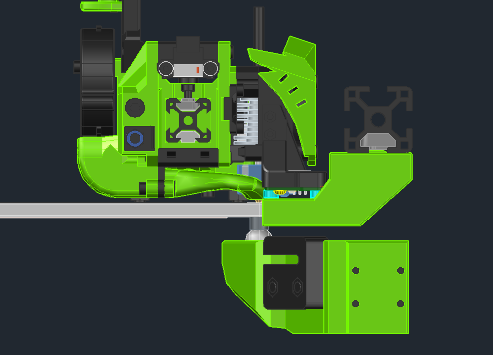
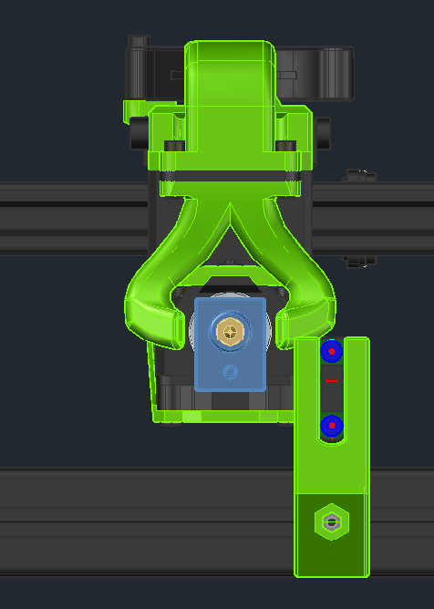
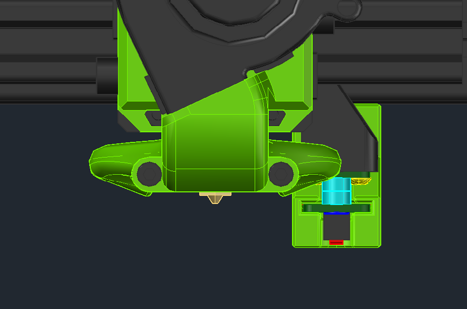

> Created by: [Dennis P.](https://github.com/nionio6915/)

A magnetically coupled, highly accurate Z probe, not affected by magnetism or temperature. Euclid Probe can function as a probe and endstop. Supported in RRF, Klipper and Marlin. 

[https://github.com/nionio6915/Euclid_Probe](https://github.com/nionio6915/Euclid_Probe) 

Print one EVA mount and one of the frame mounted docks. The M3 Heatsert has bores of 4.8mm diam x 5.5mm tall. The M3_Pilot version has pilot holes for tapped M3 threads.  

You will need one M5x20 screw and T-nut to attach the dock to the frame, and the usual M3 screws to attach the mount to the EVA carraige. 

