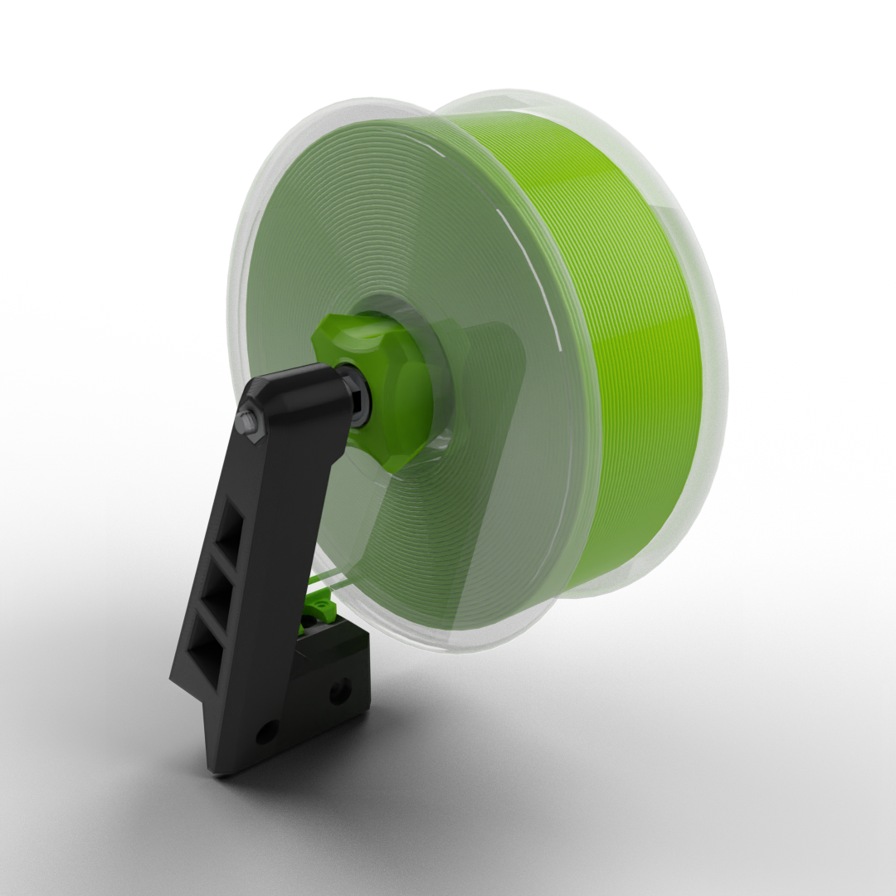

> Created by: [Paweł Kucmus](https://main.eva-3d.page)

A spool holder with a screw, knob and a filament guide.

You can get different lengths of the screw thread and ends for different 
bearings (608 or 688) you can get those from 
[Onshape](https://cad.onshape.com/documents/c347782b8c92b21780d96bef/w/b88421730fcb90f0d84e16bb/e/4df0478d09f36656e6b06300).

| No | Qty | Name                                           | Printable |
| -- | --- | ---------------------------------------------- | --------- |
| 1  | 2   | M3 x 12mm                                      | No        |
| 2  | 2   | M3 Hen nuts                                    | No        |
| 3  | 3   | M8 Hen nuts                                    | No        |
| 4  | 1   | M8 threaded rod (screw thead length + 90mm)    | No        |
| 5  | 2   | 608 or 688 bearings                            | No        |
| 6  | 1   | Arm 3030 / 2020                                | [Yes (3030)](stl/3030_2020_spool_holder_arm_3030.stl) / [Yes (2020)](stl/3030_2020_spool_holder_arm_2020.stl) |
| 7  | 1   | Guide                                          | [Yes](stl/3030_2020_spool_holder_guide.stl)      |
| 8  | 1   | Screw (90mm)                                   | [Yes](stl/3030_2020_spool_holder_screw_90mm.stl) |
| 9  | 1   | Knob                                           | [Yes](stl/3030_2020_spool_holder_knob.stl)       |

